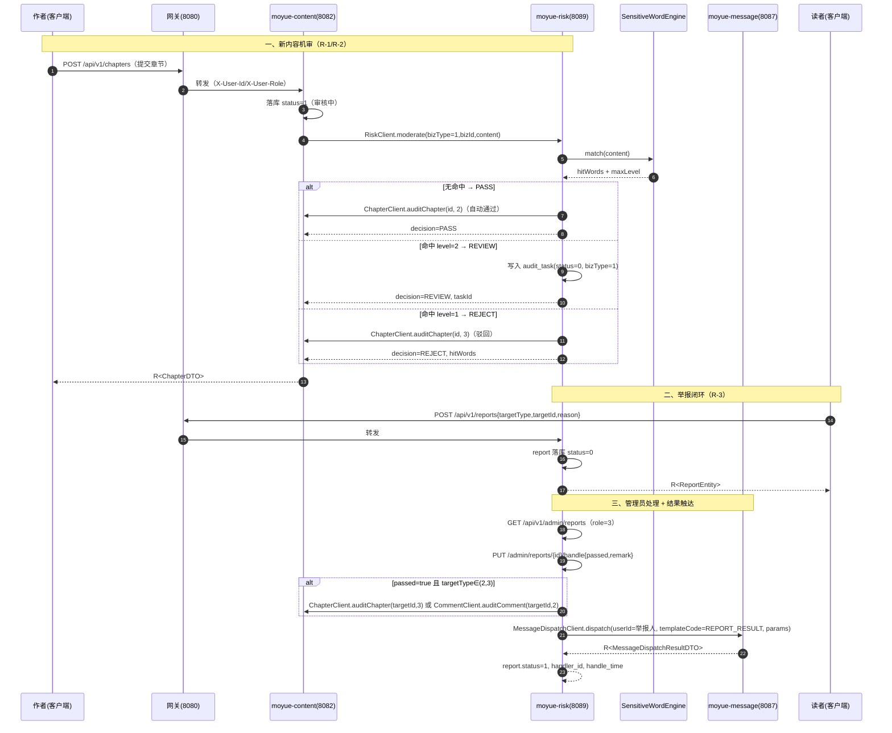
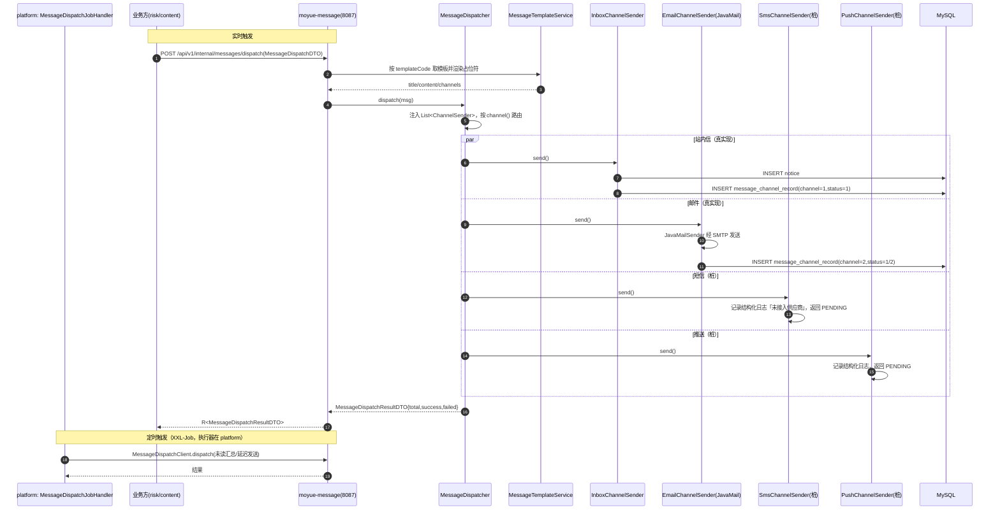
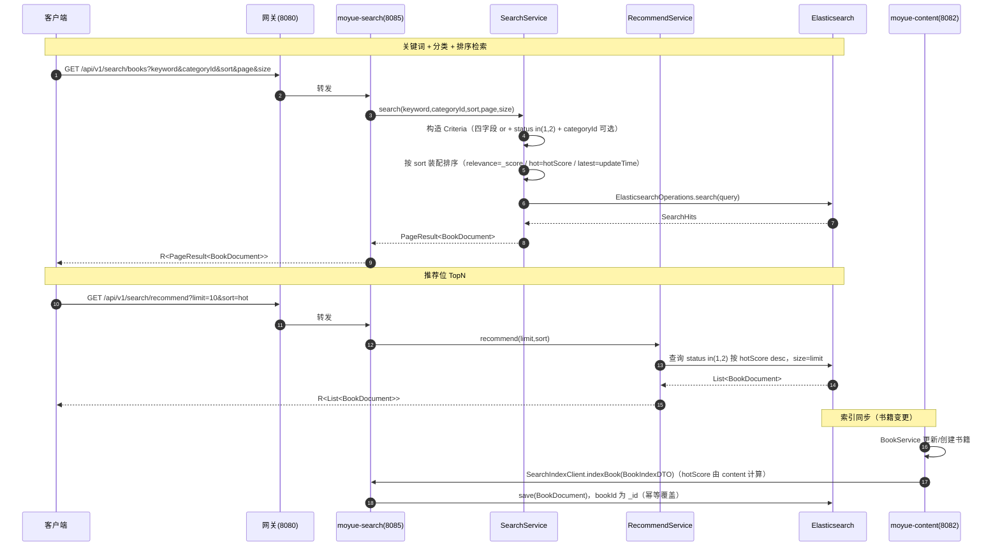
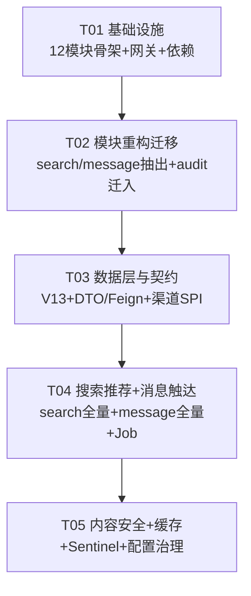

# 墨阅小说网 · P2-13 ~ P2-17 系统架构设计 + 任务分解

> 文档类型：系统架构设计（含任务分解，供工程师批量实现）
> 作者：高见远（Architect）｜版本：v1.0
> 输入：`deliverables/prd/p2-13-17-prd.md`
> 根目录：`C:\Users\linxi\WorkBuddy\2026-09-09-22-55-46\moyue-parent`
> 范围：模块重构（9 → 12）+ P2-13 搜索推荐 + P2-14 消息触达 + P2-15 内容安全 + P2-16 缓存性能 + P2-17 配置治理

---

## 一、实现方案与框架选型

### 1.1 核心技术挑战

| 挑战 | 说明 | 应对 |
|---|---|---|
| 域抽取不破坏存量 | `com.moyue.search` / `com.moyue.message` / `com.moyue.audit` 需从 content / social / platform 抽出，HTTP 路径与 DTO 契约必须零变更 | **模块 ≠ 包名**：整包平移，包名保持 `com.moyue.search` / `com.moyue.message` / `com.moyue.audit` 不变；启动类 `@ComponentScan("com.moyue")` 统一扫描；仅改父 POM `<modules>` 与网关 `lb://` 目标 |
| 机审与人工审核共用审核队列 | 机审要写 `audit_task`，人工审核也要读写 `audit_task`；若分属两个服务会出现跨服务写同一张表 | **审核域（人工）随内容安全域一起迁入 `moyue-risk`**，`audit_task` 单一属主（详见 §3.2 决策 D0） |
| 渠道可插拔 | 站内信/邮件真实现，短信/推送桩实现，新增渠道不改业务代码 | `ChannelSender` SPI + Spring `List<ChannelSender>` 注入，按 `MessageChannel` 枚举路由 |
| 敏感词过滤性能 | 大词库逐词 `contains` 是 O(n·m) | 自实现 **Trie/DFA（Aho-Corasick 简化版）**，启动加载 + 定时/写时刷新，零外部依赖 |
| 网关限流/熔断 | 需在 WebFlux 网关生效且降级体仍是 `R<T>`（HTTP 200） | **Sentinel**（`spring-cloud-alibaba-sentinel-gateway`），路由级 `GatewayFlowRule` + 自定义 `BlockRequestHandler` 输出 `R` |
| 本地无 ES/Nacos 可启动 | 验收要求 | docker-compose 补 ES；Nacos Config 用 `optional:` 导入 + profile 开关 |

### 1.2 框架与依赖选型

| 能力 | 选型 | 理由 |
|---|---|---|
| 搜索/推荐 | 复用现有 **Spring Data Elasticsearch**（`spring-boot-starter-data-elasticsearch`），整包迁入 `moyue-search` | 已有真 ES 实现，零改造成本；推荐位复用同一索引 |
| 消息触达 | **`spring-boot-starter-mail`**（JavaMail）真实现邮件；站内信复用 `notice` 表；短信/推送桩 | JavaMail 是 Spring 官方集成，SMTP 全可配（MailHog 可本地验证），无需第三方 SDK |
| 限流/熔断 | **Sentinel**（`spring-cloud-starter-alibaba-sentinel` + `spring-cloud-alibaba-sentinel-gateway`，版本由 `spring-cloud-alibaba-dependencies:2023.0.1.0` 管理） | 已确认决策；网关适配器直出 WebFlux 过滤链 |
| 敏感词 | 自研 Trie/DFA（无新增依赖） | 词库可控、性能可预期、避免引入重型 NLP |
| 缓存 | 复用 `moyue-common` 的 `MoyueCacheAutoConfiguration` + `CacheNames`（BOOK_LIST/BOOK_DETAIL 已在 `RedisCacheManager` 注册 5/10 分钟 TTL） | 基建已有，仅需补 `@Cacheable`/`@CacheEvict` 引用 |
| 定时任务 | **XXL-Job 2.4.0**，执行器仍由 `moyue-platform` 承载（`appname=moyue-job`，RPC 9099） | 硬约束：不引入第二套调度；触达任务在 platform 用 `@XxlJob`，经 Feign 调 `moyue-message` |
| 迁移 | **Flyway**，全部集中在 `moyue-common/src/main/resources/db/migration/`（新增 `V13`） | 硬约束：全服务共享同一迁移目录 |

**Sentinel 依赖坐标（版本继承，无需写死）**

```xml
<!-- 网关（moyue-gateway） -->
<dependency>
  <groupId>com.alibaba.cloud</groupId>
  <artifactId>spring-cloud-starter-alibaba-sentinel</artifactId>
</dependency>
<dependency>
  <groupId>com.alibaba.cloud</groupId>
  <artifactId>spring-cloud-alibaba-sentinel-gateway</artifactId>
</dependency>
<!-- 业务服务（按需，P1 熔断；本次至少 risk/message/content 引入） -->
<dependency>
  <groupId>com.alibaba.cloud</groupId>
  <artifactId>spring-cloud-starter-alibaba-sentinel</artifactId>
</dependency>
```

**网关接入方式**：`spring-cloud-alibaba-sentinel-gateway` 自动装配 `SentinelGatewayFilter` 与 `SentinelGatewayBlockExceptionHandler`。因本地无 Sentinel Dashboard，规则以 **Java Bean 编程式定义**（`GatewayFlowRule` + `DegradeRule`），由 `SentinelGatewayConfig` 在网关启动时 `GatewayRuleManager.loadRules(...)` / `DegradeRuleManager.loadRules(...)` 注册；`BlockRequestHandler` 自定义为输出 `R<T>`（HTTP 200）。

**ES 抽取方式**：`com.moyue.search.*` 四个 Java 文件 + `com.moyue.content.config.ElasticsearchRepositoryConfig` 整体迁入 `moyue-search`，后者改包为 `com.moyue.search.config.ElasticsearchRepositoryConfig`（`basePackages="com.moyue.search.repository"` 不变）；`moyue-content` 移除 ES 依赖与 ES 配置段。

### 1.3 架构模式

沿用现有 **分层架构（controller / service / mapper / entity）** + **服务注册发现（Nacos）+ 声明式调用（OpenFeign）+ 网关统一鉴权**。新增三个服务：
- `moyue-search`：检索域（只读 ES，无数据库）。
- `moyue-message`：触达域（站内信 + 渠道分发 + 触达记录）。
- `moyue-risk`：内容安全域（敏感词 + 机审 + 举报 + 人工审核）。

---

## 二、模块重构方案（9 → 12）

### 2.1 12 模块最终清单与端口

| # | 模块 | 端口 | 域 | 变更 |
|---|---|---|---|---|
| 1 | moyue-common | - | 公共（R/错误码/JWT/缓存/迁移） | 改（新增 ResultCode / CacheNames / V13） |
| 2 | moyue-api | - | 跨服务契约（DTO / Feign） | 改（新增 DTO 与 Feign 客户端） |
| 3 | moyue-gateway | 8080 | 网关 | 改（路由 + Sentinel + 密钥环境变量） |
| 4 | moyue-account | 8081 | 账号域 | 仅配置治理 |
| 5 | moyue-content | 8082 | 内容域（书城/章节/阅读） | 改（移出 search；加缓存/机审 hook/索引同步） |
| 6 | moyue-social | 8083 | 社区域（评论/博客/IM） | 改（移出 message；加机审 hook） |
| 7 | moyue-commerce | 8084 | 商业域 | 仅配置治理 |
| 8 | moyue-platform | 8086 | 平台域（运营/统计/系统/XXL-Job） | 改（移出 audit；加触达 Job Handler） |
| 9 | moyue-ai | 8097 | 智能域 | 仅配置治理 |
| **10** | **moyue-search** | **8085** | 检索域（新） | **新增** |
| **11** | **moyue-message** | **8087** | 触达域（新） | **新增** |
| **12** | **moyue-risk** | **8089** | 内容安全域（新） | **新增** |

### 2.2 新模块 `pom.xml` 要点

**`moyue-search/pom.xml`**
- `artifactId=moyue-search`，`mainClass=com.moyue.search.SearchApplication`
- 依赖：`spring-boot-starter-web`、`moyue-common`、`moyue-api`、`spring-cloud-starter-alibaba-nacos-discovery`、`spring-boot-starter-data-elasticsearch`、`spring-boot-starter-validation`、`lombok(provided)`
- **不含** 数据源 / MyBatis / Flyway / Feign（只读 ES）

**`moyue-message/pom.xml`**
- `artifactId=moyue-message`，`mainClass=com.moyue.message.MessageApplication`
- 依赖：`spring-boot-starter-web`、`moyue-common`、`moyue-api`、`mybatis-plus-boot-starter`、`mysql-connector-j`、`flyway-core`、`flyway-mysql`、`spring-boot-starter-data-redis`、`spring-cloud-starter-alibaba-nacos-discovery`、`spring-cloud-starter-openfeign`、`spring-cloud-starter-loadbalancer`、**`spring-boot-starter-mail`**、`spring-boot-starter-validation`、`lombok(provided)`

**`moyue-risk/pom.xml`**
- `artifactId=moyue-risk`，`mainClass=com.moyue.risk.RiskApplication`
- 依赖：`spring-boot-starter-web`、`moyue-common`、`moyue-api`、`mybatis-plus-boot-starter`、`mysql-connector-j`、`flyway-core`、`flyway-mysql`、`spring-boot-starter-data-redis`、`spring-cloud-starter-alibaba-nacos-discovery`、`spring-cloud-starter-openfeign`、`spring-cloud-starter-loadbalancer`、`spring-boot-starter-validation`、`lombok(provided)`

### 2.3 启动类（全限定名 + 注解）

三模块启动类统一沿用现有约定：

```java
// 1) com.moyue.search.SearchApplication
@SpringBootApplication
@ComponentScan("com.moyue")
@EnableDiscoveryClient
public class SearchApplication { public static void main(String[] a){ SpringApplication.run(SearchApplication.class, a);} }

// 2) com.moyue.message.MessageApplication
@SpringBootApplication
@ComponentScan("com.moyue")
@MapperScan("com.moyue")
@EnableDiscoveryClient
@EnableFeignClients("com.moyue")
public class MessageApplication { ... }

// 3) com.moyue.risk.RiskApplication
@SpringBootApplication
@ComponentScan("com.moyue")
@MapperScan("com.moyue")
@EnableDiscoveryClient
@EnableFeignClients("com.moyue")
public class RiskApplication { ... }
```

> Search 无 Mapper / 无 Feign，故不加 `@MapperScan` / `@EnableFeignClients`。

### 2.4 迁移 / 新建的包与文件清单（从哪迁到哪）

**A. 抽出 `moyue-search`（源：moyue-content）**

| 源（moyue-content） | 目标（moyue-search） | 处理 |
|---|---|---|
| `com/moyue/search/controller/SearchController.java` | `com/moyue/search/controller/SearchController.java` | 平移 |
| `com/moyue/search/service/SearchService.java` | `com/moyue/search/service/SearchService.java` | 平移 + 增强（categoryId/sort） |
| `com/moyue/search/document/BookDocument.java` | 同名 | 平移 + 扩字段 |
| `com/moyue/search/repository/BookSearchRepository.java` | 同名 | 平移 |
| `com/moyue/content/config/ElasticsearchRepositoryConfig.java` | `com/moyue/search/config/ElasticsearchRepositoryConfig.java` | 平移 + 改包 |

删除源端 5 文件；`moyue-content/pom.xml` 删除 `spring-boot-starter-data-elasticsearch`；`moyue-content/src/main/resources/application.yml` 删除 `spring.elasticsearch` 段与 `org.springframework.data.elasticsearch` 日志项。

**B. 抽出 `moyue-message`（源：moyue-social）**

| 源（moyue-social） | 目标（moyue-message） |
|---|---|
| `com/moyue/message/controller/MessageController.java` | 同名（平移，路径零变更） |
| `com/moyue/message/service/MessageService.java` | 同名（平移） |
| `com/moyue/message/entity/NoticeEntity.java` | 同名（平移） |
| `com/moyue/message/mapper/NoticeMapper.java` | 同名（平移） |

删除源端 4 文件；`moyue-social` 无需删依赖（message 未引入额外依赖）。

**C. 新建 `moyue-risk`（源：moyue-platform 的 audit 迁入 + 全新内容安全代码）**

| 源（moyue-platform） | 目标（moyue-risk） |
|---|---|
| `com/moyue/audit/controller/AuditController.java` | `com/moyue/audit/controller/AuditController.java`（路径零变更） |
| `com/moyue/audit/service/AuditService.java` | `com/moyue/audit/service/AuditService.java` |
| `com/moyue/audit/entity/AuditTaskEntity.java` | `com/moyue/audit/entity/AuditTaskEntity.java` |
| `com/moyue/audit/mapper/AuditTaskMapper.java` | `com/moyue/audit/mapper/AuditTaskMapper.java` |

删除 platform 源端 4 文件；platform 保留 `operation/stat/system/job`。

**D. 父 POM 变更**：`<modules>` 追加 `moyue-search` / `moyue-message` / `moyue-risk`（顺序置于 `moyue-ai` 之后）；`dependencyManagement` 无需新增显式版本（Sentinel 走 alibaba BOM），可选新增内部模块坐标无需（仅 common/api 被 cross-module 引用，沿用 `${project.version}`）。

**E. 网关路由变更清单**

| 路由 id | 变更 |
|---|---|
| `moyue-search` | `uri: lb://moyue-content` → **`lb://moyue-search`** |
| `moyue-message` | `uri: lb://moyue-social` → **`lb://moyue-message`** |
| `moyue-audit` | `uri: lb://moyue-platform` → **`lb://moyue-risk`** |
| `moyue-recommend`（新） | `Path=/api/v1/search/recommend` → `lb://moyue-search`（可并入 `moyue-search` 的 `/api/v1/search/**`，无需单列） |
| `moyue-report`（新） | `Path=/api/v1/reports/**` → `lb://moyue-risk` |
| `moyue-risk-admin`（新） | `Path=/api/v1/admin/reports/**`、`Path=/api/v1/admin/risk/**` → `lb://moyue-risk` |
| `moyue-message-admin`（新，P1） | `Path=/api/v1/admin/messages/**` → `lb://moyue-message` |

> `/api/v1/internal/**` 不经网关（服务间经 Nacos `lb://` 直连），网关无需新增。

---

## 三、待确认问题（PRD 第五节 10 项）默认决策

> 逐条给出默认决策，全部落地为可实现的确定值，不挂起。

| # | 问题 | 默认决策 | 理由 |
|---|---|---|---|
| **D0** | 审核域归属（衍生决策） | **人工审核 `com.moyue.audit` 从 platform 迁入 `moyue-risk`**，risk 成为内容安全域唯一属主 | 机审需写 `audit_task`、举报属实需生成审核记录；两域合一可避免「跨服务写同一张表」，`audit_task` 单一属主。HTTP 路径 `/api/v1/admin/audit/**` 不变，网关仅改 `lb://` 目标，契约无破坏 |
| 1 | 热门热度指标 | `hotScore = clickCount × 1 + favoriteCount × 3`（favoriteCount 取书架收藏数），**实时字段**写入 ES 文档，随书籍更新/索引推送刷新；不做离线快照 | 权重简单、可复现、可断言；避免引入离线聚合链路。字段由 content 在 `_index` 推送时计算 |
| 2 | `sort` 取值与默认回退 | 支持 `relevance`（默认）/`hot`/`latest`；**非法值或缺失一律回退 `relevance`**（不报错） | 保持既有行为（原实现即 `_score` 排序），向后兼容；`latest` 按文档 `updateTime` 倒序 |
| 3 | 敏感词来源与动作 | **DB 表 `sensitive_word` 管理**（分等级：`level=1 拦截 / level=2 仅告警`），启动加载进 Trie + 管理端可运维；无命中→PASS，命中 `level=1`→REJECT，命中 `level=2`→REVIEW（转人工） | DB 化可热更、可审计；分级兼顾「严词拦截」与「灰词转人工」 |
| 4 | 举报对象范围与下架 | 范围 = **书籍/章节/评论/用户**（`target_type` 1-4）；处理结果「属实/驳回」；**属实且对象为章节/评论 → 自动隐藏（复用 `auditChapter(3)` / `auditComment(2)`）；书籍/用户 → 仅记录并由管理员二次操作（预留扩展点）**；无强制 SLA，仅记录 `handle_time` | 自动下架限于可安全裁决的短文本内容，避免误伤整本书；举报闭环 = 落库→处理→触达 |
| 5 | 消息触达触发点 | 本次落地两类：**审核结果（章节/评论通过/驳回）**、**举报处理结果**；模板表支持扩展「关注更新/评论回复/系统公告」。**用户渠道偏好本次不做**（默认全渠道 = 站内信 + 邮件） | 与 R-3 闭环对齐，聚焦 P0；偏好设置列为扩展点 |
| 6 | SMTP 配置 | 全部可配：`MOYUE_MAIL_HOST/PORT/USERNAME/PASSWORD/FROM`；**dev 默认指向 MailHog**（`localhost:1025`，无认证、无 TLS）；生产由运维注入 | 本地零成本验证真发信；生产密钥不落盘 |
| 7 | Sentinel 维度/阈值/降级码 | 维度：**路由级 QPS 限流**（全局，按 route id）为主 + **登录接口按 IP 限流**（`/api/v1/auth/login` 10 QPS）；默认每路由 100 QPS（可配 `moyue.sentinel.*`）。**限流降级码复用 `FREQUENCY_LIMIT=30001`；熔断降级新增 `SERVICE_DEGRADED=40002`**；响应体 `R<T>`，HTTP 200 | 复用既有 30001，减少契约新增；熔断语义独立编码便于前端区分 |
| 8 | 缓存失效策略 | **写时主动删除**（`@CacheEvict`：`BOOK_DETAIL` 按 bookId、`BOOK_LIST` `allEntries`）+ TTL 兜底（详情 10min / 列表 5min）。防穿透：不缓存 null（基建已有）+ 详情不存在由 Controller 抛 404。防击穿/雪崩：**本次不做互斥锁**，靠短 TTL + 差异化 TTL（列 P2 C-5） | 主动删除保证「更新后无脏读」；复杂度可控 |
| 9 | 环境变量命名 | 沿用现有并可预测：`SPRING_PROFILES_ACTIVE`、`MOYUE_JWT_SECRET`、`MYSQL_HOST/PORT/DB/USERNAME/PASSWORD`、`REDIS_HOST/PORT`、`NACOS_SERVER_ADDR/NAMESPACE`、`ES_URIS`、新增 `MOYUE_MAIL_*`、`MOYUE_SENTINEL_*`。**prod/test 无明文默认值（强制注入），dev 允许本地默认值** | 兼容现有部署脚本，不制造断层；E-3「仓库内无明文口令」在 prod/test 严格满足 |
| 10 | Nacos Config 开关 | **profile 开关**：默认 `spring.cloud.nacos.config.enabled=${MOYUE_NACOS_CONFIG_ENABLED:false}`（不加载）；启用时追加 `nacos` profile，其 `spring.config.import: optional:nacos:${spring.application.name}.yaml`。`optional:` 前缀保证 Nacos 不可达也不阻塞启动 | 同一套 `application.yml` 在开/关两态均可启动 |

**E-2 密钥处理**：`moyue-gateway/src/main/resources/application.yml:154` 明文改为 `${MOYUE_JWT_SECRET:moyue-jwt-dev-secret-key-0123456789abcdefghij}`（与 account 一致；dev 安全默认值 + 启动日志 WARN 提示），生产必须经环境变量覆盖。

---

## 四、文件列表（相对 `moyue-parent`）

### 4.1 新增文件

```
# ===== moyue-search（新模块）=====
moyue-search/pom.xml
moyue-search/src/main/java/com/moyue/search/SearchApplication.java
moyue-search/src/main/java/com/moyue/search/config/ElasticsearchRepositoryConfig.java
moyue-search/src/main/java/com/moyue/search/config/SearchProperties.java
moyue-search/src/main/java/com/moyue/search/controller/SearchController.java
moyue-search/src/main/java/com/moyue/search/controller/SearchInternalController.java
moyue-search/src/main/java/com/moyue/search/service/SearchService.java
moyue-search/src/main/java/com/moyue/search/service/RecommendService.java
moyue-search/src/main/java/com/moyue/search/document/BookDocument.java
moyue-search/src/main/java/com/moyue/search/repository/BookSearchRepository.java
moyue-search/src/main/java/com/moyue/search/constant/SearchSort.java
moyue-search/src/main/resources/application.yml
moyue-search/src/main/resources/application-dev.yml
moyue-search/src/main/resources/application-test.yml
moyue-search/src/main/resources/application-prod.yml

# ===== moyue-message（新模块）=====
moyue-message/pom.xml
moyue-message/src/main/java/com/moyue/message/MessageApplication.java
moyue-message/src/main/java/com/moyue/message/config/MybatisPlusConfig.java
moyue-message/src/main/java/com/moyue/message/config/MailProperties.java
moyue-message/src/main/java/com/moyue/message/channel/ChannelSender.java
moyue-message/src/main/java/com/moyue/message/channel/MessageChannel.java
moyue-message/src/main/java/com/moyue/message/channel/ChannelSendResult.java
moyue-message/src/main/java/com/moyue/message/channel/InboxChannelSender.java
moyue-message/src/main/java/com/moyue/message/channel/EmailChannelSender.java
moyue-message/src/main/java/com/moyue/message/channel/SmsChannelSender.java
moyue-message/src/main/java/com/moyue/message/channel/PushChannelSender.java
moyue-message/src/main/java/com/moyue/message/service/MessageDispatcher.java
moyue-message/src/main/java/com/moyue/message/service/MessageTemplateService.java
moyue-message/src/main/java/com/moyue/message/service/MessageService.java
moyue-message/src/main/java/com/moyue/message/controller/MessageController.java
moyue-message/src/main/java/com/moyue/message/controller/MessageInternalController.java
moyue-message/src/main/java/com/moyue/message/controller/MessageRecordAdminController.java
moyue-message/src/main/java/com/moyue/message/entity/NoticeEntity.java
moyue-message/src/main/java/com/moyue/message/entity/MessageTemplateEntity.java
moyue-message/src/main/java/com/moyue/message/entity/MessageChannelRecordEntity.java
moyue-message/src/main/java/com/moyue/message/mapper/NoticeMapper.java
moyue-message/src/main/java/com/moyue/message/mapper/MessageTemplateMapper.java
moyue-message/src/main/java/com/moyue/message/mapper/MessageChannelRecordMapper.java
moyue-message/src/main/resources/application.yml
moyue-message/src/main/resources/application-dev.yml
moyue-message/src/main/resources/application-test.yml
moyue-message/src/main/resources/application-prod.yml

# ===== moyue-risk（新模块）=====
moyue-risk/pom.xml
moyue-risk/src/main/java/com/moyue/risk/RiskApplication.java
moyue-risk/src/main/java/com/moyue/risk/config/MybatisPlusConfig.java
moyue-risk/src/main/java/com/moyue/risk/config/SensitiveWordProperties.java
moyue-risk/src/main/java/com/moyue/risk/sensitive/SensitiveWordEntity.java
moyue-risk/src/main/java/com/moyue/risk/sensitive/SensitiveWordMapper.java
moyue-risk/src/main/java/com/moyue/risk/sensitive/SensitiveWordEngine.java
moyue-risk/src/main/java/com/moyue/risk/sensitive/SensitiveWordService.java
moyue-risk/src/main/java/com/moyue/risk/sensitive/SensitiveWordAdminController.java
moyue-risk/src/main/java/com/moyue/risk/moderation/ModerationService.java
moyue-risk/src/main/java/com/moyue/risk/moderation/ModerationInternalController.java
moyue-risk/src/main/java/com/moyue/risk/report/ReportEntity.java
moyue-risk/src/main/java/com/moyue/risk/report/ReportMapper.java
moyue-risk/src/main/java/com/moyue/risk/report/ReportService.java
moyue-risk/src/main/java/com/moyue/risk/report/ReportController.java
moyue-risk/src/main/java/com/moyue/risk/report/ReportAdminController.java
moyue-risk/src/main/java/com/moyue/risk/audit/controller/AuditController.java          # 由 platform 迁入
moyue-risk/src/main/java/com/moyue/risk/audit/entity/AuditTaskEntity.java              # 由 platform 迁入
moyue-risk/src/main/java/com/moyue/risk/audit/mapper/AuditTaskMapper.java              # 由 platform 迁入
moyue-risk/src/main/java/com/moyue/risk/audit/service/AuditService.java                # 由 platform 迁入
moyue-risk/src/main/resources/application.yml
moyue-risk/src/main/resources/application-dev.yml
moyue-risk/src/main/resources/application-test.yml
moyue-risk/src/main/resources/application-prod.yml

# ===== moyue-common =====
moyue-common/src/main/resources/db/migration/V13__content_safety_and_reach.sql

# ===== moyue-api =====
moyue-api/src/main/java/com/moyue/api/client/SearchIndexClient.java
moyue-api/src/main/java/com/moyue/api/client/MessageDispatchClient.java
moyue-api/src/main/java/com/moyue/api/client/RiskClient.java
moyue-api/src/main/java/com/moyue/api/dto/BookIndexDTO.java
moyue-api/src/main/java/com/moyue/api/dto/ModerationRequestDTO.java
moyue-api/src/main/java/com/moyue/api/dto/ModerationResultDTO.java
moyue-api/src/main/java/com/moyue/api/dto/MessageDispatchDTO.java
moyue-api/src/main/java/com/moyue/api/dto/MessageDispatchResultDTO.java

# ===== moyue-gateway =====
moyue-gateway/src/main/java/com/moyue/gateway/config/SentinelGatewayConfig.java
moyue-gateway/src/main/java/com/moyue/gateway/config/GatewayBlockHandler.java

# ===== moyue-platform =====
moyue-platform/src/main/java/com/moyue/job/handler/MessageDispatchJobHandler.java

# ===== 根 =====
moyue-parent/.env.example        # 新增（环境变量样例，不含真实密钥）
moyue-parent/README-env.md       # 新增（多环境与配置治理说明）
```

### 4.2 改动文件

```
pom.xml                                                  # 父 POM <modules> 追加 3 模块
moyue-gateway/pom.xml                                    # + Sentinel（starter + gateway 适配器）
moyue-gateway/src/main/resources/application.yml         # 路由 3 改 3 增；Sentinel 段；JWT 密钥改环境变量
moyue-content/pom.xml                                    # 移除 data-elasticsearch
moyue-content/src/main/resources/application.yml         # 移除 ES 段/日志段；datasource 默认值下沉 dev
moyue-content/src/main/resources/application-dev.yml     # 新增/补 dev 默认值（datasource/redis/es）
moyue-content/src/main/java/com/moyue/book/service/BookService.java      # @Cacheable/@CacheEvict + 索引同步 hook
moyue-content/src/main/java/com/moyue/book/controller/BookController.java # 无需改路径（缓存透明）
moyue-content/src/main/java/com/moyue/chapter/service/ChapterService.java # 提交/发布时机审 hook
moyue-social/src/main/java/com/moyue/comment/service/CommentService.java  # 发表评论机审 hook
moyue-platform/src/main/resources/application.yml         # job 段保留；datasource 默认值下沉 dev
moyue-common/src/main/java/com/moyue/common/ResultCode.java   # + SERVICE_DEGRADED(40002)、CONTENT_BLOCKED(20002)
moyue-common/src/main/java/com/moyue/common/cache/CacheNames.java  # 可选 +RECOMMEND（推荐位缓存，P1）
moyue-api/src/main/java/com/moyue/api/dto/BookSummaryDTO.java  # + clickCount（向后兼容）
剩余 5 个存量模块（account/commerce/social/platform/ai）application*.yml  # 统一 profiles/环境变量治理
```

**删除文件**：`moyue-content/.../com/moyue/search/**`（4）、`moyue-content/.../com/moyue/content/config/ElasticsearchRepositoryConfig.java`（1）、`moyue-social/.../com/moyue/message/**`（4，实为迁出）、`moyue-platform/.../com/moyue/audit/**`（4，实为迁出）。

**非工程文件改动**：`C:\Users\linxi\WorkBuddy\2026-09-09-22-55-46\docker-compose.yml` 新增 `elasticsearch:8.13.x`（单节点、`xpack.security.enabled=false`、`9200:9200`）+ 可选 `mailhog`（`1025` SMTP / `8025` WebUI）。

---

## 五、数据结构与接口

### 5.1 Flyway V13 表结构（`moyue-common/src/main/resources/db/migration/V13__content_safety_and_reach.sql`）

```sql
-- V13：内容安全（敏感词 / 举报）+ 消息触达（模板 / 触达记录）（P2-13~17）

CREATE TABLE IF NOT EXISTS `sensitive_word` (
  `id`          BIGINT       NOT NULL                COMMENT '主键（雪花 ID）',
  `word`        VARCHAR(64)  NOT NULL                COMMENT '敏感词',
  `level`       TINYINT      NOT NULL DEFAULT 1      COMMENT '等级：1 拦截 / 2 告警（转人工）',
  `category`    VARCHAR(32)  DEFAULT NULL            COMMENT '分类：政治/广告/谩骂/涉黄…',
  `status`      TINYINT      NOT NULL DEFAULT 1      COMMENT '状态：0 停用 / 1 启用',
  `is_deleted`  TINYINT(1)   NOT NULL DEFAULT 0      COMMENT '逻辑删除',
  `create_time` DATETIME     NOT NULL DEFAULT CURRENT_TIMESTAMP,
  `update_time` DATETIME     NOT NULL DEFAULT CURRENT_TIMESTAMP ON UPDATE CURRENT_TIMESTAMP,
  PRIMARY KEY (`id`),
  UNIQUE KEY `uk_word` (`word`),
  KEY `idx_status_level` (`status`, `level`)
) ENGINE=InnoDB DEFAULT CHARSET=utf8mb4 COMMENT='敏感词库';

CREATE TABLE IF NOT EXISTS `report` (
  `id`            BIGINT       NOT NULL              COMMENT '举报主键（雪花 ID）',
  `reporter_id`   BIGINT       NOT NULL              COMMENT '举报人 → user.id',
  `target_type`   TINYINT      NOT NULL              COMMENT '对象：1 书籍 / 2 章节 / 3 评论 / 4 用户',
  `target_id`     BIGINT       NOT NULL              COMMENT '对象主键',
  `reason_type`   TINYINT      NOT NULL DEFAULT 1    COMMENT '原因：1 违规内容 / 2 广告 / 3 侵权 / 4 其他',
  `reason`        VARCHAR(500) DEFAULT NULL          COMMENT '补充说明',
  `status`        TINYINT      NOT NULL DEFAULT 0    COMMENT '状态：0 待处理 / 1 属实 / 2 驳回',
  `handler_id`    BIGINT       DEFAULT NULL          COMMENT '处理人 → 管理员 ID',
  `handle_remark` VARCHAR(255) DEFAULT NULL          COMMENT '处理意见',
  `handle_time`   DATETIME     DEFAULT NULL          COMMENT '处理时间',
  `is_deleted`    TINYINT(1)   NOT NULL DEFAULT 0    COMMENT '逻辑删除',
  `create_time`   DATETIME     NOT NULL DEFAULT CURRENT_TIMESTAMP,
  `update_time`   DATETIME     NOT NULL DEFAULT CURRENT_TIMESTAMP ON UPDATE CURRENT_TIMESTAMP,
  PRIMARY KEY (`id`),
  KEY `idx_status` (`status`),
  KEY `idx_target` (`target_type`, `target_id`),
  KEY `idx_reporter` (`reporter_id`)
) ENGINE=InnoDB DEFAULT CHARSET=utf8mb4 COMMENT='举报表';

CREATE TABLE IF NOT EXISTS `message_template` (
  `id`          BIGINT        NOT NULL,
  `code`        VARCHAR(64)   NOT NULL              COMMENT '模板编码，如 AUDIT_PASS / REPORT_RESULT',
  `name`        VARCHAR(64)   NOT NULL              COMMENT '模板名称',
  `title_tpl`   VARCHAR(255)  DEFAULT NULL          COMMENT '标题模板，占位符 {param}',
  `content_tpl` VARCHAR(1000) NOT NULL              COMMENT '内容模板',
  `channels`    VARCHAR(64)   NOT NULL DEFAULT '1'  COMMENT '默认渠道，逗号分隔：1 站内信/2 邮件/3 短信/4 推送',
  `status`      TINYINT       NOT NULL DEFAULT 1    COMMENT '状态：0 停用 / 1 启用',
  `is_deleted`  TINYINT(1)    NOT NULL DEFAULT 0,
  `create_time` DATETIME      NOT NULL DEFAULT CURRENT_TIMESTAMP,
  `update_time` DATETIME      NOT NULL DEFAULT CURRENT_TIMESTAMP ON UPDATE CURRENT_TIMESTAMP,
  PRIMARY KEY (`id`),
  UNIQUE KEY `uk_code` (`code`)
) ENGINE=InnoDB DEFAULT CHARSET=utf8mb4 COMMENT='消息模板表';

CREATE TABLE IF NOT EXISTS `message_channel_record` (
  `id`            BIGINT        NOT NULL,
  `user_id`       BIGINT        NOT NULL            COMMENT '接收用户 → user.id',
  `channel`       TINYINT       NOT NULL            COMMENT '渠道：1 站内信/2 邮件/3 短信/4 推送',
  `template_code` VARCHAR(64)   DEFAULT NULL        COMMENT '模板编码',
  `target`        VARCHAR(128)  DEFAULT NULL        COMMENT '投递地址（邮箱/手机号）',
  `title`         VARCHAR(128)  DEFAULT NULL,
  `content`       VARCHAR(1000) DEFAULT NULL,
  `biz_type`      VARCHAR(64)   DEFAULT NULL        COMMENT '业务类型，如 AUDIT / REPORT',
  `biz_id`        BIGINT        DEFAULT NULL        COMMENT '业务主键',
  `status`        TINYINT       NOT NULL DEFAULT 0  COMMENT '0 待发 / 1 成功 / 2 失败',
  `error_msg`     VARCHAR(255)  DEFAULT NULL,
  `retry_count`   INT           NOT NULL DEFAULT 0,
  `send_time`     DATETIME      DEFAULT NULL,
  `is_deleted`    TINYINT(1)    NOT NULL DEFAULT 0,
  `create_time`   DATETIME      NOT NULL DEFAULT CURRENT_TIMESTAMP,
  `update_time`   DATETIME      NOT NULL DEFAULT CURRENT_TIMESTAMP ON UPDATE CURRENT_TIMESTAMP,
  PRIMARY KEY (`id`),
  KEY `idx_user` (`user_id`),
  KEY `idx_status` (`status`),
  KEY `idx_template` (`template_code`)
) ENGINE=InnoDB DEFAULT CHARSET=utf8mb4 COMMENT='消息触达记录表';

-- 种子：敏感词（分级）
INSERT IGNORE INTO `sensitive_word` (`id`,`word`,`level`,`category`) VALUES
 (910000000000000001,'示例敏感词A',1,'政治'),
 (910000000000000002,'示例敏感词B',1,'广告'),
 (910000000000000003,'示例灰词C',2,'谩骂');

-- 种子：消息模板
INSERT IGNORE INTO `message_template` (`id`,`code`,`name`,`title_tpl`,`content_tpl`,`channels`) VALUES
 (920000000000000001,'AUDIT_PASS','审核通过','{bizName}审核通过','您提交的{bizName}已通过审核。','1,2'),
 (920000000000000002,'AUDIT_REJECT','审核驳回','{bizName}审核驳回','您提交的{bizName}未通过审核：{reason}','1,2'),
 (920000000000000003,'REPORT_RESULT','举报处理结果','您的举报已处理','您对{targetDesc}的举报处理结果：{result}。','1,2');
```

> 说明：`notice` 表沿用 V3，不改结构；`audit_task` 沿用 V1/V10，**不改结构**（`biz_type` 由 TINYINT 承载新语义：1 章节 / 2 评论 / 3 书籍 / 4 用户）。

### 5.2 新增/调整 REST 接口

**moyue-search（网关 `/api/v1/search/**` → `lb://moyue-search`）**

| 方法 | 路径 | 请求 | 响应 | 权限 |
|---|---|---|---|---|
| GET | `/api/v1/search/books` | `keyword`(必), `categoryId`(选), `sort`(选，`relevance`默认/`hot`/`latest`), `page`(默认1), `size`(默认20) | `R<PageResult<BookDocument>>` | 登录 |
| GET | `/api/v1/search/recommend` | `limit`(默认10，≤50), `sort`(默认`hot`) | `R<List<BookDocument>>` | 登录 |
| POST | `/api/v1/internal/search/books/_index` | `BookIndexDTO` | `R<BookDocument>` | 内部 |
| DELETE | `/api/v1/internal/search/books/{bookId}` | path | `R<Void>` | 内部 |

> `GET /api/v1/search/books` 路径不变，仅新增可选参数 → 契约向后兼容。

**moyue-message（网关 `/api/v1/messages/**` → `lb://moyue-message`）**

| 方法 | 路径 | 请求 | 响应 | 权限 |
|---|---|---|---|---|
| GET | `/api/v1/messages/{userId}` | `unreadOnly`(默认false) | `R<List<NoticeEntity>>` | 登录（原样） |
| POST | `/api/v1/messages` | `NoticeEntity` | `R<Void>` | 登录（原样） |
| PUT | `/api/v1/messages/{noticeId}/read` | - | `R<Void>` | 登录（原样） |
| PUT | `/api/v1/messages/users/{userId}/read-all` | - | `R<Integer>` | 登录（原样） |
| POST | `/api/v1/internal/messages/dispatch` | `MessageDispatchDTO` | `R<MessageDispatchResultDTO>` | 内部 |
| GET | `/api/v1/admin/messages/records` | `userId?`、`channel?`、`status?`、`page`、`size` | `R<PageResult<MessageChannelRecordEntity>>` | role=3 |

**moyue-risk（网关 `/api/v1/reports/**`、`/api/v1/admin/reports/**`、`/api/v1/admin/risk/**`、`/api/v1/admin/audit/**` → `lb://moyue-risk`）**

| 方法 | 路径 | 请求 | 响应 | 权限 |
|---|---|---|---|---|
| POST | `/api/v1/reports` | `ReportCreateRequest{targetType,targetId,reasonType,reason}` | `R<ReportEntity>` | 登录 |
| GET | `/api/v1/reports/mine` | `page`、`size` | `R<PageResult<ReportEntity>>` | 登录 |
| GET | `/api/v1/admin/reports` | `status?`、`targetType?`、`page`、`size` | `R<PageResult<ReportEntity>>` | role=3 |
| PUT | `/api/v1/admin/reports/{id}/handle` | `ReportHandleRequest{passed(Boolean),remark}` | `R<ReportEntity>` | role=3 |
| GET | `/api/v1/admin/risk/sensitive-words` | `page`、`size`、`level?` | `R<PageResult<SensitiveWordEntity>>` | role=3 |
| POST | `/api/v1/admin/risk/sensitive-words` | `SensitiveWordEntity` | `R<SensitiveWordEntity>` | role=3 |
| PUT | `/api/v1/admin/risk/sensitive-words/{id}` | `SensitiveWordEntity` | `R<SensitiveWordEntity>` | role=3 |
| POST | `/api/v1/internal/risk/moderate` | `ModerationRequestDTO` | `R<ModerationResultDTO>` | 内部 |
| GET | `/api/v1/admin/audit/comments` | `bizType?` | `R<List<AuditTaskEntity>>` | role=3（原样） |
| GET | `/api/v1/admin/audit/tasks` | `status?`、`bizType?` | `R<List<AuditTaskEntity>>` | role=3（原样） |
| PUT | `/api/v1/admin/audit/tasks/{taskId}/approve` | `remark?` | `R<AuditTaskEntity>` | role=3（原样） |
| PUT | `/api/v1/admin/audit/tasks/{taskId}/reject` | `remark?` | `R<AuditTaskEntity>` | role=3（原样） |

**moyue-content / moyue-social（既有路径零变更）**：仅在服务内部新增 hook（`ChapterService`/`CommentService`/`BookService` 调用 Feign），不改任何对外路径。

### 5.3 关键 DTO / 枚举契约（moyue-api）

```java
// com.moyue.api.dto.BookIndexDTO
{ Long bookId; String title; Long categoryId; String categoryName; String authorName;
  String coverUrl; String description; Integer status;
  Long clickCount; Long favoriteCount; Long hotScore; LocalDateTime updateTime; }

// com.moyue.api.dto.ModerationRequestDTO
{ Integer bizType;   // 1 章节 / 2 评论 / 3 书籍
  Long bizId; String title; String content; }

// com.moyue.api.dto.ModerationResultDTO
{ String decision;   // PASS | REVIEW | REJECT
  List<String> hitWords; Integer maxLevel;  // 0 无 / 1 拦截 / 2 告警
  Long taskId; }     // REVIEW 时生成的 audit_task.id，可空

// com.moyue.api.dto.MessageDispatchDTO
{ Long userId; String templateCode; Map<String,String> params;
  List<Integer> channels;      // 空则取模板默认渠道
  String targetEmail; String targetPhone;   // 可选，覆盖用户资料
  String bizType; Long bizId; }

// com.moyue.api.dto.MessageDispatchResultDTO
{ int total; int success; int failed; List<String> channelDetails; }
```

```java
// moyue-message 渠道枚举
public enum MessageChannel { INBOX(1), EMAIL(2), SMS(3), PUSH(4); ... }

// 渠道 SPI（硬契约，见 §七 共享知识）
public interface ChannelSender {
    MessageChannel channel();                                  // 渠道标识
    ChannelSendResult send(ChannelMessage msg);                // 统一发送语义
}
```

---

## 六、程序调用流程（时序图）

### 6.1 机审 + 举报闭环



### 6.2 消息触达分发



### 6.3 搜索推荐（含索引同步）



### 6.4 类图（关键协作）

```mermaid
classDiagram
    class ChannelSender {
        <<interface>>
        +MessageChannel channel()
        +ChannelSendResult send(ChannelMessage msg)
    }
    class InboxChannelSender
    class EmailChannelSender
    class SmsChannelSender
    class PushChannelSender
    class MessageDispatcher {
        -List~ChannelSender~ senders
        +MessageDispatchResultDTO dispatch(MessageDispatchDTO dto)
    }
    class MessageService {
        +listByUser(userId, unreadOnly)
        +send(NoticeEntity)
        +markRead(noticeId, userId)
        +markAllRead(userId)
    }
    class MessageTemplateService {
        +render(code, params) Template
    }
    class MessageController
    class MessageInternalController
    class NoticeEntity
    class MessageTemplateEntity
    class MessageChannelRecordEntity

    ChannelSender <|.. InboxChannelSender
    ChannelSender <|.. EmailChannelSender
    ChannelSender <|.. SmsChannelSender
    ChannelSender <|.. PushChannelSender
    MessageDispatcher --> ChannelSender : uses
    MessageDispatcher --> MessageTemplateService : uses
    InboxChannelSender --> MessageService : 复用站内信写入
    MessageInternalController --> MessageDispatcher
    MessageController --> MessageService
    MessageService --> NoticeEntity
    MessageTemplateService --> MessageTemplateEntity
    MessageDispatcher --> MessageChannelRecordEntity

    class SearchService {
        +search(keyword, categoryId, sort, page, size) PageResult~BookDocument~
        +index(BookDocument)
        +remove(bookId)
    }
    class RecommendService {
        +recommend(limit, sort) List~BookDocument~
    }
    class BookDocument {
        +Long bookId
        +String title
        +Long categoryId
        +String categoryName
        +String authorName
        +String description
        +Integer status
        +Long clickCount
        +Long favoriteCount
        +Long hotScore
        +LocalDateTime updateTime
    }
    class SearchController
    class SearchInternalController
    SearchController --> SearchService
    SearchController --> RecommendService
    SearchInternalController --> SearchService
    SearchService --> BookDocument
    RecommendService --> BookDocument

    class SensitiveWordEngine {
        +reload()
        +match(text) List~String~
    }
    class SensitiveWordService
    class ModerationService {
        +moderate(ModerationRequestDTO) ModerationResultDTO
    }
    class ReportService {
        +submit(...)
        +handle(id, passed, remark, operatorId)
    }
    class AuditService {
        +listPending(bizType)
        +listTasks(status, bizType)
        +decide(taskId, passed, remark, operatorId)
    }
    class SensitiveWordEntity
    class ReportEntity
    class AuditTaskEntity
    class ModerationInternalController

    ModerationService --> SensitiveWordEngine
    ModerationService --> AuditTaskEntity : 生成人工任务
    ModerationService --> ReportService : 无
    SensitiveWordService --> SensitiveWordEngine : 刷新词库
    SensitiveWordService --> SensitiveWordEntity
    ReportService --> ReportEntity
    ReportService --> AuditService : 属实联动
    AuditService --> AuditTaskEntity
    ModerationInternalController --> ModerationService

    class ChapterClient { <<Feign>> }
    class CommentClient { <<Feign>> }
    class MessageDispatchClient { <<Feign>> }
    class SearchIndexClient { <<Feign>> }
    class RiskClient { <<Feign>> }
    ModerationService ..> ChapterClient
    ModerationService ..> CommentClient
    ReportService ..> ChapterClient
    ReportService ..> CommentClient
    ReportService ..> MessageDispatchClient
    AuditService ..> ChapterClient
    AuditService ..> CommentClient
```



---

## 七、共享知识 / 跨文件约定

1. **统一响应体**：所有接口返回 `com.moyue.common.R<T>`（`code/message/data/traceId`，HTTP 统一 200）。`code=0` 成功。
   - 新增业务码：`CONTENT_BLOCKED=20002`（内容命中敏感词被拦截）、`SERVICE_DEGRADED=40002`（熔断降级）；限流复用既有 `FREQUENCY_LIMIT=30001`。
2. **网关透传身份**：`X-User-Id` / `X-User-Role`（`com.moyue.common.Constants`）。`/api/v1/admin/**` 由 `AdminRoleInterceptor` 断言 `role=3`（risk 模块自动继承，无需额外配置）。
3. **Feign 契约**：所有 Feign 返回 `R<DTO>`；**必须显式判 `code`**（全局异常以 HTTP 200 + 非 0 code 承载，Feign 不抛业务异常）。降级：`@Autowired(required=false)` + try/catch 记 warn，不阻断主链路（沿用既有风格）。
4. **渠道 SPI 契约（硬约定）**：
   - `MessageChannel` 枚举：`INBOX(1)/EMAIL(2)/SMS(3)/PUSH(4)`。
   - `ChannelSender`：`MessageChannel channel()` + `ChannelSendResult send(ChannelMessage msg)`。
   - 新增渠道 = 新增一个 `ChannelSender` 实现（`@Component`），业务代码零改动。
   - `ChannelSendResult{boolean success; boolean pending; String detail;}`；桩实现返回 `pending=true` 且**不抛异常**。
   - 分发器按 `senders.stream().filter(s -> s.channel()==c)` 路由；单一渠道失败不影响其它渠道（逐渠道 try/catch）。
5. **敏感词返回结构（硬约定）**：`ModerationResultDTO{decision∈{PASS,REVIEW,REJECT}, hitWords[], maxLevel∈{0,1,2}, taskId?}`。
   - 判定规则：无命中→`PASS`；有 `level=2` 命中且无 `level=1`→`REVIEW`；出现 `level=1` 命中→`REJECT`（`maxLevel` 取命中最高级）。
6. **缓存 key 规则**：`moyue:<cacheName>::<javaKey>`（前缀由 `MoyueCacheAutoConfiguration.KEY_PREFIX` 固定）。
   - `book:detail` → key = `bookId`
   - `book:list` → key = `page + ":" + size`
   - 写操作失效：`BOOK_DETAIL` 按 bookId 精确失效；`BOOK_LIST` `allEntries=true`（分页维度无法逐个推导）。
7. **环境变量命名（硬约定）**：见 §三 D9。**prod/test 严禁明文默认值**；dev 允许本地默认。
8. **Flyway**：迁移集中在 `moyue-common/src/main/resources/db/migration/`，本批次唯一新增 `V13`。**无数据库的模块（moyue-search）不配置 datasource/flyway**。
9. **端口约定**：search 8085 / message 8087 / risk 8089；不改动既有 8080-8084、8086、8097。
10. **包名约定**：模块 ≠ 包名，迁移时保持 `com.moyue.search` / `com.moyue.message` / `com.moyue.audit` 包名；`@ComponentScan("com.moyue")` 统一扫描。
11. **XXL-Job**：执行器唯一承载在 `moyue-platform`（`appname=moyue-job`，RPC 9099）；新任务以 `@XxlJob("messageDispatchJob")` 写在 `com.moyue.job.handler`，经 Feign 调 `moyue-message`，不新增执行器。
12. **Sentinel 降级体**：网关 `BlockRequestHandler` 统一输出 `R.fail(code,msg)`，`DegradeException`→40002，其余 `BlockException`（限流）→30001。

---

## 八、依赖包清单

```
# 继承 spring-boot-starter-parent:3.2.12（版本省略）
org.springframework.boot:spring-boot-starter-web
org.springframework.boot:spring-boot-starter-validation
org.springframework.boot:spring-boot-starter-cache
org.springframework.boot:spring-boot-starter-data-redis
org.springframework.boot:spring-boot-starter-data-elasticsearch   # 仅 moyue-search
org.springframework.boot:spring-boot-starter-mail                # 仅 moyue-message（新增）
org.springframework.boot:spring-boot-starter-data-redis
org.springframework:spring-web (moyue-common, 无版本→parent)
org.springframework:spring-webmvc (moyue-common, provided)

# MyBatis-Plus / MySQL / Flyway（版本见父 POM 或 parent）
com.baomidou:mybatis-plus-boot-starter:3.5.7
com.mysql:mysql-connector-j
org.flywaydb:flyway-core
org.flywaydb:flyway-mysql

# Spring Cloud / Alibaba（版本由 parent / BOM 管理）
org.springframework.cloud:spring-cloud-dependencies:2023.0.5            # import
com.alibaba.cloud:spring-cloud-alibaba-dependencies:2023.0.1.0          # import
org.springframework.cloud:spring-cloud-starter-gateway
org.springframework.cloud:spring-cloud-starter-openfeign
org.springframework.cloud:spring-cloud-starter-loadbalancer
com.alibaba.cloud:spring-cloud-starter-alibaba-nacos-discovery
com.alibaba.cloud:spring-cloud-starter-alibaba-sentinel                 # 新增（网关 + 业务）
com.alibaba.cloud:spring-cloud-alibaba-sentinel-gateway                 # 新增（仅网关）

# 其他
com.xuxueli:xxl-job-core:2.4.0
io.jsonwebtoken:jjwt-api / jjwt-impl / jjwt-jackson:0.12.6
org.projectlombok:lombok (provided)

# 测试（继承 parent）
org.springframework.boot:spring-boot-starter-test
org.springframework.boot:spring-boot-testcontainers
org.testcontainers:junit-jupiter:1.19.8
org.testcontainers:mysql:1.19.8
```

> 说明：`moyue-search` / `moyue-message` / `moyue-risk` 的 `pom.xml` 中 Sentinel、Nacos、Feign 等**均不写版本号**（由父 POM 的 BOM 管理）。

---

## 九、任务列表（有序，按依赖）

> 硬约束：**不超过 5 个任务**；首任务 = 项目基础设施；每任务 ≥3 个相关文件；按功能模块/层次分组。
> 工程师按 T01 → T05 顺序分批实现。

### T01 项目基础设施：12 模块骨架 + 网关 + 依赖声明（P0）
- **目标**：父 POM 扩到 12 模块；3 个新模块具备可编译骨架（pom + 启动类 + 4 份 yml）；docker-compose 补 ES；网关加 Sentinel 依赖与降级骨架；补齐全局常量（ResultCode/CacheNames）。
- **源文件**：
  - `pom.xml`（父，`<modules>` 追加 3 项）
  - `moyue-search/pom.xml`、`.../com/moyue/search/SearchApplication.java`、`moyue-search/src/main/resources/application{,-dev,-test,-prod}.yml`
  - `moyue-message/pom.xml`、`.../com/moyue/message/MessageApplication.java`、`application{,-dev,-test,-prod}.yml`
  - `moyue-risk/pom.xml`、`.../com/moyue/risk/RiskApplication.java`、`application{,-dev,-test,-prod}.yml`
  - `moyue-gateway/pom.xml`（+Sentinel）、`moyue-gateway/src/main/java/com/moyue/gateway/config/{SentinelGatewayConfig,GatewayBlockHandler}.java`
  - `moyue-common/.../ResultCode.java`、`moyue-common/.../cache/CacheNames.java`
  - `docker-compose.yml`（根，+elasticsearch、可选 +mailhog）
  - `moyue-parent/.env.example`
- **依赖**：无
- **优先级**：P0

### T02 模块重构迁移：search/message 抽出 + audit 迁入 risk（P0）
- **目标**：三处整包平移，删除源端文件，清理受影响 pom 与 yml，网关路由 3 改。
- **源文件**：
  - 迁出：`moyue-content`→`moyue-search`（SearchController/SearchService/BookDocument/BookSearchRepository/ElasticsearchRepositoryConfig）
  - 迁出：`moyue-social`→`moyue-message`（MessageController/MessageService/NoticeEntity/NoticeMapper）
  - 迁出：`moyue-platform`→`moyue-risk`（audit 的 Controller/Service/Entity/Mapper）
  - `moyue-content/pom.xml`（-data-elasticsearch）、`moyue-content/src/main/resources/application.yml`（-ES 段）、`moyue-content/src/main/resources/application-dev.yml`
  - `moyue-gateway/src/main/resources/application.yml`（3 路由改 uri + 3 新路由）
- **依赖**：T01
- **优先级**：P0

### T03 数据层与跨模块契约：V13 + DTO/Feign + 渠道 SPI 接口（P0）
- **目标**：落库结构与跨服务契约先定稿，后续实现依赖它。
- **源文件**：
  - `moyue-common/src/main/resources/db/migration/V13__content_safety_and_reach.sql`
  - `moyue-api/.../client/{SearchIndexClient,MessageDispatchClient,RiskClient}.java`
  - `moyue-api/.../dto/{BookIndexDTO,ModerationRequestDTO,ModerationResultDTO,MessageDispatchDTO,MessageDispatchResultDTO}.java`
  - `moyue-api/.../dto/BookSummaryDTO.java`（+clickCount）
  - `moyue-message/.../channel/{ChannelSender,MessageChannel,ChannelSendResult}.java`
- **依赖**：T02
- **优先级**：P0

### T04 搜索推荐 + 消息触达：search 全量 + message 全量 + 触达 Job（P0/P1）
- **目标**：落地 P2-13（S-1/S-2/S-3）与 P2-14（N-1~N-5）。
- **源文件**：
  - `moyue-search/.../service/{SearchService,RecommendService}.java`、`document/BookDocument.java`、`constant/SearchSort.java`、`controller/SearchController.java`、`controller/SearchInternalController.java`、`config/{ElasticsearchRepositoryConfig,SearchProperties}.java`
  - `moyue-message/.../channel/{InboxChannelSender,EmailChannelSender,SmsChannelSender,PushChannelSender}.java`、`service/{MessageDispatcher,MessageTemplateService,MessageService}.java`、`controller/{MessageInternalController,MessageRecordAdminController}.java`、`entity/{MessageTemplateEntity,MessageChannelRecordEntity}.java`、`mapper/{MessageTemplateMapper,MessageChannelRecordMapper}.java`、`config/{MybatisPlusConfig,MailProperties}.java`
  - `moyue-platform/.../job/handler/MessageDispatchJobHandler.java`
  - `moyue-content/.../book/service/BookService.java`（索引同步 hook）
- **依赖**：T03
- **优先级**：P0（N-5、S-3 为 P1）

### T05 内容安全 + 缓存 + Sentinel + 配置治理 + 集成（P0/P1）
- **目标**：落地 P2-15（R-1~R-4）、P2-16（C-1~C-3）、P2-17（E-1~E-4），并完成端到端联调。
- **源文件**：
  - `moyue-risk/.../sensitive/*`（Entity/Mapper/Engine/Service/AdminController、`config/SensitiveWordProperties`）
  - `moyue-risk/.../moderation/{ModerationService,ModerationInternalController}.java`
  - `moyue-risk/.../report/*`（Entity/Mapper/Service/Controller/AdminController）
  - `moyue-risk/.../audit/*`（迁入后按内容安全需求微调）、`config/MybatisPlusConfig.java`
  - `moyue-content/.../book/service/BookService.java`（+缓存注解）、`moyue-content/.../chapter/service/ChapterService.java`（机审 hook）、`moyue-social/.../comment/service/CommentService.java`（机审 hook）
  - `moyue-gateway/.../config/SentinelGatewayConfig.java`（规则）
  - 12 模块 `application{,-dev,-test,-prod}.yml`（profiles + 环境变量 + Nacos 开关）、`moyue-parent/README-env.md`
- **依赖**：T04
- **优先级**：P0（P1：C-3、E-4、R-4）

---

## 十、任务依赖图



---

## 十一、待明确事项（残留假设）

1. **`audit_task` 的插入方**：现有代码只读/裁决 `audit_task`，未见任何**写入端**（`ChapterService.publish` 仅置 `status=1`，`CommentService.addComment` 仅置 `status=0`，均未插入任务行）。本设计假设：**由 `moyue-risk` 的 `ModerationService` 在 `REVIEW` 判定时写入 `audit_task`**，作为该表的唯一写入方。若历史存在其它写入路径（如初始化脚本或未纳入本次核查的代码），需工程实现时确认后对齐。
2. **索引写入触发点**：现状 `moyue_book` 索引仅经 `/internal/search/books/_index` 手动推送，书籍 CRUD **未见自动同步**。本设计将「书籍创建/更新 → `SearchIndexClient.indexBook`」列为 T04 的 P1 增强；若本次只要求「手动索引端点可用」（S-4），则自动同步可延后。
3. **ES 版本与字段类型**：现文档未标注 ES 版本；设计按 **ES 8.13.x 单节点（关闭安全）** 假设。`hotScore`/`clickCount`/`updateTime` 均按数值/日期字段（`FieldType.Long` / `Date`）映射，若线上 ES 版本不同需微调 `@Field` 类型。
4. **dev 默认值是否合规**：D9 决策允许 dev profile 保留 `localhost/root` 等本地默认值（便于开箱启动），严格意义上会命中「仓库内无明文口令」的 grep 检查。若验收要求绝对零明文，工程实现时可将 dev 默认值改为 `CHANGE_ME` 占位并要求本地通过 `.env`/docker-compose 注入——此项请在实现前与产品/QA 确认口径。
5. **邮件真实收件人来源**：`EmailChannelSender` 需用户邮箱；现有 `user` 表**无 email 列**（`sys_user` 有）。设计假设：优先取 `MessageDispatchDTO.targetEmail`，缺失时经 `UserClient` 解析（若用户域无邮箱则跳过邮件渠道并记 `pending`）。
6. **推荐位缓存**：`CacheNames.RECOMMEND` 为可选（P1），若不做则推荐位每次实时查 ES。
