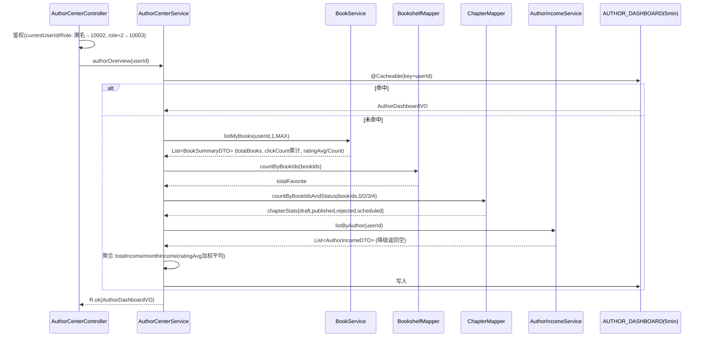
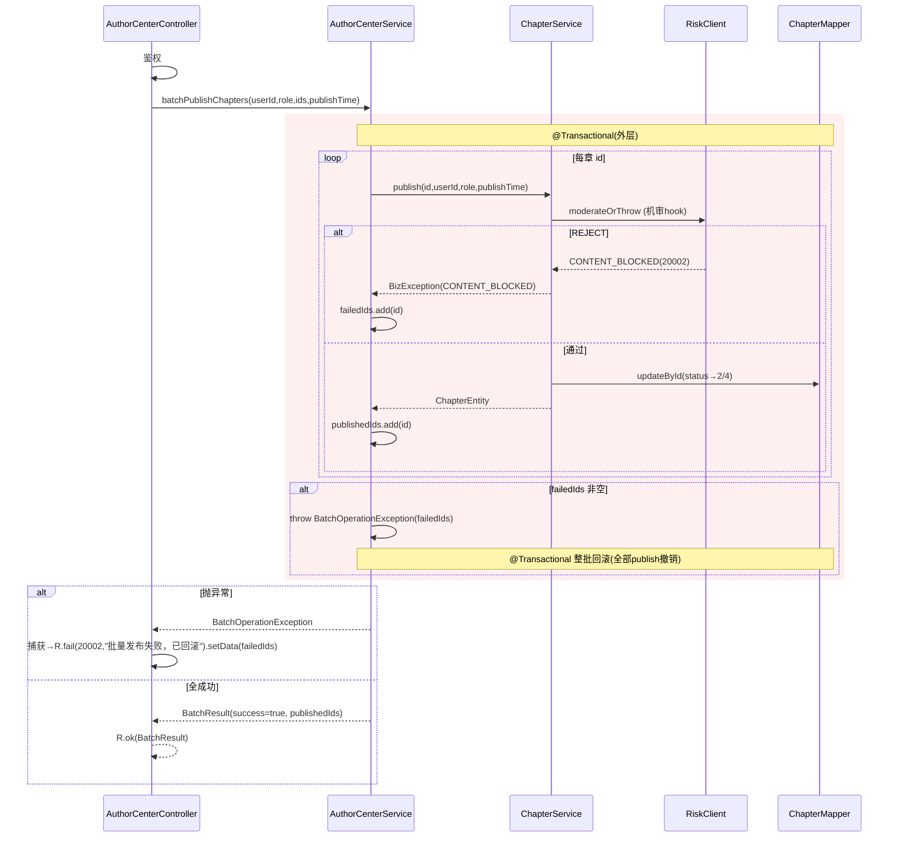
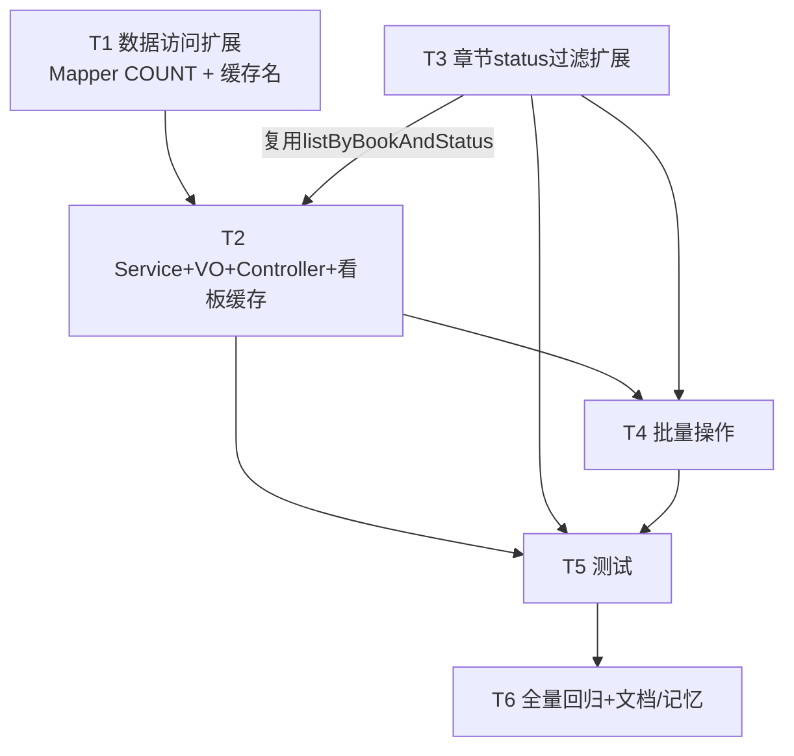

# 墨阅小说网 · 作者创作中心（P0）增量架构设计与任务分解

> 模块：作者创作中心（规模 M~L，纯后端，单体 `moyue-parent`）
> 技术栈：Spring Boot 3.2.12 / Java 17 / MyBatis-Plus 3.5.7 / Redis+Caffeine 两级缓存
> 作者：`software-architect-2`（高见远） ｜ 完成日期：2026-09-09
> 设计原则：IN 收敛（复用既有写能力）+ 零 Flyway 变更 + 单体不回退已落地结构

---

## 0. 代码核实结论（先读后设计，已逐条比对 PRD）

| PRD 引用 | 核实结果 |
|---|---|
| `BookService.listMyBooks(userId,page,size)` | ✅ 真实存在；签名为 `listMyBooks(long userId, int page, int size)`，返回 `PageResult<BookSummaryDTO>` |
| `BookController GET /books/mine` | ✅ 存在，内部调 `bookService.listMyBooks` |
| `ChapterService.listDrafts(bookId,page,size)` | ✅ 存在（status=0） |
| `ChapterService.create/update/delete/publish/reorder/auditChapter/activateScheduledChapters` | ✅ 全部存在 |
| `ChapterService.checkBookOwner` / `requireAuthor` | ⚠️ **存在但为 `private`**，外部（含新 `AuthorCenterService`）不可直接调用 |
| `ChapterEntity.status` 0/1/2/3 + 运行期 `STATUS_SCHEDULED=4` | ✅ 字段存在；`STATUS_SCHEDULED=4` 是 `ChapterService` 私有常量；**实体注释仅写到 3，缺 4**（PRD 修正点） |
| `AuthorIncomeService.listByAuthor(authorId)` | ✅ 存在，返回 `List<AuthorIncomeDTO>` |
| `AuthorService.listByAuthor` / `listSettlements` | ✅ 存在；均 `@Autowired(required=false)` 降级，返回空集合 |
| `BookEntity.clickCount(BigDecimal→实际 Long)/ratingAvg(BigDecimal)/ratingCount(Integer)` | ✅ `clickCount` 为 `Long`，`ratingAvg` 为 `BigDecimal`，`ratingCount` 为 `Integer` |
| `bookshelf` 表(user_id,book_id,is_deleted) | ✅ `BookshelfEntity` 含 `bookId`/`isDeleted`；`BookshelfMapper` 当前**仅 `revive`**，缺 `countByBookId` |
| `ChapterMapper` | ⚠️ 当前 `extends BaseMapper<ChapterEntity>` **无任何自定义方法**，缺 `countByBookIdAndStatus` |
| `CacheNames` / `MoyueCacheAutoConfiguration.perCache` | ✅ 存在；`perCache` 为显式 Map，新增缓存名需在此登记 TTL |
| `ResultCode` 段位 | ✅ 0/10001/10002/10003/20001/20002/20003/30001/40001/40002/50001/60001 与 PRD 完全一致，**本模块复用不新开区段** |
| 最新迁移 | ✅ 最新为 `V28__notice_is_deleted.sql`（幂等 ALTER 惯用法） |
| `SecurityContextHolder.currentUserId()/currentRole()` | ✅ 返回 `Long`/`Integer`，匿名返回 `null` |
| 既有 `com.moyue.author.center` / `AuthorCenter*` | ✅ 确认不存在，全新包 |

**核心结论：P0 主体可「零 Flyway 变更」落地**——全部为聚合查询（复用 `listMyBooks`/`listByAuthor`）+ 对既有表的纯 COUNT 查询 + 复用既有写能力（`chapterService.publish/deleteChapter`）。仅 `BookshelfMapper`/`ChapterMapper` 各增 2 个 COUNT 方法（命中既有列，无 DDL），`CacheNames`+`perCache` 登记一项配置。详见 §5 任务清单的迁移标记。

---

## 1. 实现方案 + 框架选型

### 1.1 难点分析
1. **身份与归属校验**：读者(role=1)/匿名不得进入创作中心；单作者维度，看板按 `author_id=user.id` 聚合，需对「全部作品」「单作品」两种粒度做归属校验。
2. **多源聚合**：看板需跨 `book`/`chapter`/`bookshelf`/`author_income` 四张表聚合，且 `author_income` 经 Feign（`AuthorIncomeService`/`AuthorService`）取数，需优雅降级。
3. **实时性 vs 性能**：看板为聚合重查询，主理人拍板「实时查库 + 5min 缓存」，对齐 `INBOX`/`LEADERBOARD` 风格。
4. **批量发布原子性**：任一章机审 `CONTENT_BLOCKED` 即整批回滚，并返回失败章节列表。

### 1.2 框架 / 库选型（沿用既有，无新增）
| 能力 | 选型 | 说明 |
|---|---|---|
| Web 框架 | Spring MVC（既有） | 新增 `AuthorCenterController`，路径前缀 `/api/v1` 对齐网关 |
| ORM | MyBatis-Plus 3.5.7（既有） | 新增方法仅用 `@Select` 原生 COUNT，**显式带 `is_deleted=0`**（自定义 SQL 不自动走 `@TableLogic` 拦截器） |
| 缓存 | Redis + Caffeine 两级（`MoyueCacheAutoConfiguration`，既有） | 新增 `CacheNames.AUTHOR_DASHBOARD` + `perCache` 登记 TTL=5min |
| 声明式事务 | Spring `@Transactional`（既有） | 批量操作用外层事务实现整批回滚 |
| 跨域取数 | Feign Client（`AuthorIncomeService`/`AuthorService`，既有 `@Autowired(required=false)`） | 不可用降级为空，不阻断主流程 |
| 逻辑删除 | `@TableLogic`（既有，逐实体） | COUNT SQL 中手动 `is_deleted=0` 对齐 |
| 测试 | JUnit5 + MockMvc/TestRestTemplate + H2（既有，禁 Docker） | 见 §5 T5 |

> 无新框架、无新三方依赖。**依赖包列表见 §6（确认零新增）。**

### 1.3 架构分层
```
AuthorCenterController        (入口/鉴权/参数/批量失败捕获)
        │
        ▼
AuthorCenterService          (聚合编排/@Cacheable/@Transactional; 自管归属校验)
        ├── BookService.listMyBooks / detail        (复用)
        ├── AuthorIncomeService.listByAuthor        (复用, Feign 降级)
        ├── AuthorService.listByAuthor/listSettlements (复用, Feign 降级)
        ├── BookshelfMapper.countByBookId(s)        (新增 COUNT)
        ├── ChapterMapper.countByBookIdAndStatus(s) (新增 COUNT)
        └── ChapterService.publish/deleteChapter    (复用既有写能力+机审hook+归属校验)
```

---

## 2. 文件列表（绝对路径，标注 新增/扩展/复用）

业务包根：`C:\Users\linxi\WorkBuddy\2026-09-09-22-55-46\moyue-parent\moyue-app\src\main\java\com\moyue`

### 2.1 新增（`com.moyue.author.center`）
| 文件 | 说明 |
|---|---|
| `...\author\center\AuthorCenterController.java` | 创作中心 REST 入口：鉴权、`/author/center/overview`、`/author/center/books/{bookId}/dashboard`、`/author/center/income`、`/author/center/chapters/batch-*`；批量失败捕获 |
| `...\author\center\AuthorCenterService.java` | 聚合编排核心：`authorOverview`/`bookDashboard`/`listIncome`/批量操作（@Cacheable/@Transactional） |
| `...\author\center\AuthorDashboardVO.java` | 汇总看板 VO（全作品累计） |
| `...\author\center\AuthorBookDashboardVO.java` | 单作品看板 VO（继承汇总字段 + 作品基础信息 + 单书章节统计） |
| `...\author\center\AuthorIncomeVO.java` | 稿酬流水 VO（投影 `AuthorIncomeDTO`） |
| `...\author\center\BatchResult.java` | 批量操作统一返回（success/publishedIds/failedIds） |
| `...\author\center\BatchOperationException.java` | 批量失败异常，承载 `failedIds`（`extends RuntimeException`，触发 @Transactional 回滚） |

### 2.2 扩展（既有文件增量改动）
| 文件 | 改动点 |
|---|---|
| `...\chapter\service\ChapterService.java` | 新增 **public** `listByBookAndStatus(Long bookId, Integer status, int page, int size)`（复用 `listByBook` 逻辑 + 可选 status 过滤；供 `GET /chapters?status=` 与复用） |
| `...\chapter\controller\ChapterController.java` | `GET /chapters` 增加可选 `@RequestParam(required=false) Integer status`，有值时改调 `listByBookAndStatus`（向后兼容：无 status 仍走 `listByBook`） |
| `...\read\mapper\BookshelfMapper.java` | 新增 `countByBookId(Long)` 与 `countByBookIds(List<Long>)`（@Select，显式 `is_deleted=0`） |
| `...\chapter\mapper\ChapterMapper.java` | 新增 `countByBookIdAndStatus(Long, int)` 与 `countByBookIdsAndStatus(List<Long>, int)`（@Select，显式 `is_deleted=0`） |
| `...\common\cache\CacheNames.java` | 新增常量 `AUTHOR_DASHBOARD = "author:dashboard"` |
| `...\common\cache\MoyueCacheAutoConfiguration.java` | `perCache` Map 内登记 `CacheNames.AUTHOR_DASHBOARD → defaultConfig(Duration.ofMinutes(5))` |

### 2.3 复用（不改动）
`BookService.listMyBooks/detail`、`AuthorIncomeService.listByAuthor`、`AuthorService.listByAuthor/listSettlements`、`ChapterService.publish/deleteChapter/auditChapter/activateScheduledChapters`、`BookEntity`/`ChapterEntity`/`BookshelfEntity`、`ResultCode`/`SecurityContextHolder`/`R`/`BizException`、`BookClient`(取书信息)、`BookSummaryDTO`/`AuthorIncomeDTO`。

### 2.4 测试（新增，`src/test/java/com/moyue/author/center/`）
| 文件 | 覆盖 |
|---|---|
| `AuthorCenterServiceTest.java` | 汇总/单书看板字段聚合、收入汇总/本月收入、归属校验 |
| `AuthorCenterCacheTest.java` | `AUTHOR_DASHBOARD` 5min 缓存命中/失效（Spring Context + Mock 或真实缓存） |
| `ChapterBatchOpTest.java` | 批量删/发/改状态：整批回滚 + 失败列表（含机审 `CONTENT_BLOCKED` 中断） |
| `AuthorDashboardIntegrationTest.java` | 经 MockMvc/TestRestTemplate 全流程（H2） |
| `..\read\mapper\BookshelfMapperTest.java`（扩展） | `countByBookId`/`countByBookIds` |
| `..\chapter\mapper\ChapterMapperTest.java`（扩展） | `countByBookIdAndStatus`/`countByBookIdsAndStatus` |

---

## 3. 数据结构与接口（类图级）

### 3.1 字段定义
**`AuthorDashboardVO`（汇总看板）**
- `int totalBooks`
- `long totalClick` — 全部作品 `clickCount` 求和
- `long totalFavorite` — 全部作品在 `bookshelf` 的收藏数合计
- `java.math.BigDecimal totalIncome` — 全部稿酬 `amount` 求和（元，`setScale(2,HALF_UP)`）
- `java.math.BigDecimal monthIncome` — 当月（`settleMonth=YYYY-MM`）稿酬求和
- `ChapterStat chapterStats` — `{long draft, long published, long rejected, long scheduled}`
- `java.math.BigDecimal ratingAvg` — 全部作品按 `ratingCount` 加权平均
- `int ratingCount` — 全部作品 `ratingCount` 求和

**`AuthorBookDashboardVO extends AuthorDashboardVO`** — 额外带单书基础信息：
- `BookBasicInfo book` — `{Long bookId, String title, String author, String coverUrl, Integer status, Long wordCount, Long clickCount, BigDecimal ratingAvg, Integer ratingCount, String category}`（来源 `BookSummaryDTO` + `BookEntity`）

**`AuthorIncomeVO`**（投影 `AuthorIncomeDTO`）
- `Long id, Long authorId, Long bookId, Integer incomeType, BigDecimal amount, String settleMonth, Long settlementId, LocalDateTime createTime`

**`BatchResult`**
- `boolean success`
- `List<Long> publishedIds`（或 deletedIds/updatedIds）
- `List<Long> failedIds`

### 3.2 方法签名（核心）
```java
// AuthorCenterService
AuthorDashboardVO          authorOverview(Long userId);                       // @Cacheable(AUTHOR_DASHBOARD, key=userId)
AuthorBookDashboardVO      bookDashboard(Long userId, Long bookId);          // @Cacheable(AUTHOR_DASHBOARD, key=userId+':'+bookId)
List<AuthorIncomeVO>       listIncome(Long userId, Long bookId);             // 不缓存
BatchResult batchDeleteChapters(Long userId, int role, List<Long> chapterIds);
BatchResult batchPublishChapters(Long userId, int role, List<Long> chapterIds, LocalDateTime publishTime);
BatchResult batchUpdateStatus(Long userId, int role, List<Long> chapterIds, int targetStatus); // targetStatus∈{0,1}

// ChapterService（新增 public）
PageResult<ChapterEntity> listByBookAndStatus(Long bookId, Integer status, int page, int size);

// BookshelfMapper（新增）
@Select("SELECT COUNT(1) FROM bookshelf WHERE book_id=#{bookId} AND is_deleted=0")
int countByBookId(@Param("bookId") Long bookId);
@Select("<script>SELECT COUNT(1) FROM bookshelf WHERE is_deleted=0 AND book_id IN " +
        "<foreach collection='bookIds' item='id' open='(' separator=',' close=')'>#{id}</foreach></script>")
int countByBookIds(@Param("bookIds") List<Long> bookIds);

// ChapterMapper（新增）
@Select("SELECT COUNT(1) FROM chapter WHERE book_id=#{bookId} AND status=#{status} AND is_deleted=0")
int countByBookIdAndStatus(@Param("bookId") Long bookId, @Param("status") int status);
@Select("<script>SELECT COUNT(1) FROM chapter WHERE status=#{status} AND is_deleted=0 AND book_id IN " +
        "<foreach collection='bookIds' item='id' open='(' separator=',' close=')'>#{id}</foreach></script>")
int countByBookIdsAndStatus(@Param("bookIds") List<Long> bookIds, @Param("status") int status);
```

### 3.3 类图（Mermaid，另存 `docs/class-diagram.mermaid`）

```mermaid
classDiagram
    class AuthorCenterController {
        +overview()
        +bookDashboard(bookId)
        +listIncome(bookId)
        +batchDelete(ids)
        +batchPublish(ids, publishTime)
        +batchUpdateStatus(ids, status)
    }
    class AuthorCenterService {
        +AuthorDashboardVO authorOverview(userId)
        +AuthorBookDashboardVO bookDashboard(userId, bookId)
        +List~AuthorIncomeVO~ listIncome(userId, bookId)
        +BatchResult batchDeleteChapters(userId, role, ids)
        +BatchResult batchPublishChapters(userId, role, ids, time)
        +BatchResult batchUpdateStatus(userId, role, ids, status)
    }
    class AuthorDashboardVO {
        int totalBooks
        long totalClick
        long totalFavorite
        BigDecimal totalIncome
        BigDecimal monthIncome
        ChapterStat chapterStats
        BigDecimal ratingAvg
        int ratingCount
    }
    class AuthorBookDashboardVO {
        BookBasicInfo book
    }
    class AuthorIncomeVO {
        Long id; Long authorId; Long bookId
        Integer incomeType; BigDecimal amount
        String settleMonth; Long settlementId
        LocalDateTime createTime
    }
    class BatchResult {
        boolean success
        List~Long~ publishedIds
        List~Long~ failedIds
    }
    class ChapterStat {
        long draft; long published
        long rejected; long scheduled
    }
    class BookBasicInfo {
        Long bookId; String title; String author
        String coverUrl; Integer status; Long wordCount
        Long clickCount; BigDecimal ratingAvg; Integer ratingCount; String category
    }
    class BookService {
        +listMyBooks(userId,page,size)
        +detail(bookId)
    }
    class AuthorIncomeService {
        +listByAuthor(authorId)
    }
    class AuthorService {
        +listByAuthor(userId)
        +listSettlements(userId)
    }
    class ChapterService {
        +publish(chapterId,userId,role,time)
        +deleteChapter(chapterId,userId,role)
        +listByBookAndStatus(bookId,status,page,size)
    }
    class BookshelfMapper {
        +countByBookId(bookId)
        +countByBookIds(bookIds)
    }
    class ChapterMapper {
        +countByBookIdAndStatus(bookId,status)
        +countByBookIdsAndStatus(bookIds,status)
    }

    AuthorCenterController --> AuthorCenterService : 调用
    AuthorCenterService ..> BookService : 复用
    AuthorCenterService ..> AuthorIncomeService : 复用(Feign降级)
    AuthorCenterService ..> AuthorService : 复用(Feign降级)
    AuthorCenterService ..> BookshelfMapper : 新增COUNT
    AuthorCenterService ..> ChapterMapper : 新增COUNT
    AuthorCenterService ..> ChapterService : 复用写能力
    AuthorBookDashboardVO --|> AuthorDashboardVO
    AuthorDashboardVO *-- ChapterStat
    AuthorBookDashboardVO *-- BookBasicInfo
    BatchResult <.. AuthorCenterService : 返回
```


---

## 4. 程序调用流程（时序图）

### 4.1 看板聚合链路（controller → service → 各源聚合 → @Cacheable）


### 4.2 批量发布链路（controller → service → 循环 publish → @Transactional 回滚）


> **已知约束（轻微）**：批量整批回滚时，内层 `publish` 已触发的 `CHAPTER_CATALOG`/`CHAPTER_CONTENT` `@CacheEvict` 可能先于外层回滚执行，导致极短窗口（≤TTL 5~10min）目录缓存与 DB 轻微不一致，随 TTL 自愈；P0 不额外处理。批量删除/改状态采用同构「整批回滚 + 失败列表」策略。

---

## 5. 任务列表（有序、含依赖、按实现顺序；标注 Flyway 迁移）

> **迁移结论总览**：T1~T6 **全部不需要 Flyway 迁移**（V1~V28 不动；不新增 V29）。所有改动命中既有表/列（`bookshelf.book_id/is_deleted`、`chapter.book_id/status/is_deleted`）或纯配置/代码。

| Task | 名称 | 源文件（改动） | 依赖 | 优先级 | 需 Flyway? |
|---|---|---|---|---|---|
| **T1** | 数据访问扩展（COUNT 方法 + 缓存名登记） | `BookshelfMapper.java`、`ChapterMapper.java`、`CacheNames.java`、`MoyueCacheAutoConfiguration.java` | — | P0 | ❌ 否 |
| **T2** | 创作中心 Service + VO + Controller + 看板缓存 | `author/center/AuthorCenterService/AuthorDashboardVO/AuthorBookDashboardVO/AuthorIncomeVO/AuthorCenterController.java` | T1 | P0 | ❌ 否 |
| **T3** | 章节 status 过滤扩展 | `ChapterService.java`(listByBookAndStatus)、`ChapterController.java`(GET /chapters +status) | — | P0 | ❌ 否 |
| **T4** | 章节批量操作（删/发/状态） | `author/center/BatchResult.java`、`BatchOperationException.java`、`AuthorCenterService.java`(批量方法)、`AuthorCenterController.java`(批量端点) | T2 | P0 | ❌ 否 |
| **T5** | 测试（单元 + 缓存 + 批量 + 集成 + mapper 单测扩展） | `author/center/*Test.java`、`read/mapper/BookshelfMapperTest.java`、`chapter/mapper/ChapterMapperTest.java` | T2,T3,T4 | P0 | ❌ 否 |
| **T6** | 全量回归 + 文档/记忆同步 | 无新代码；执行全量回归、更新 `docs/` 与项目记忆 | T5 | P0 | ❌ 否 |

**实现顺序**：T1 → (T2 ‖ T3) → T4 → T5 → T6。T2 与 T3 相互独立，可并行；T4 依赖 T2（批量方法落在 AuthorCenterService）。

### 5.1 依赖图（Mermaid，另存 `docs/task-dependency-graph.mermaid`）


### 5.2 各任务要点
- **T1**：四个文件增量；`AUTHOR_DASHBOARD` 常量 + `perCache` 登记 TTL=5min（对齐 `INBOX=2min`/`LEADERBOARD=5min` 风格）。COUNT SQL **必须**显式 `is_deleted=0`（自定义 `@Select` 不触发 MP 逻辑删除拦截器）。
- **T2**：`authorOverview`/`bookDashboard` 打 `@Cacheable(CacheNames.AUTHOR_DASHBOARD, key=userId[:bookId])`；归属校验：`bookDashboard` 经 `bookService.detail(bookId).authorId == userId`（role=3 管理员放行），否则 `FORBIDDEN(10003)`；收入聚合用 `AuthorIncomeService.listByAuthor` 兜底空。
- **T3**：`listByBookAndStatus` 复用 `listByBook` 的 `PageResult` 组装，仅增加可选 `status` 等值过滤；`GET /chapters?status=` 向后兼容（无 status 仍走 `listByBook`）。
- **T4**：三个批量方法均 `@Transactional`（外层）；循环调用既有 `chapterService.publish/deleteChapter`，捕获 `BizException` 收集 `failedIds`；任一失败抛 `BatchOperationException(failedIds)` 触发整批回滚；Controller 捕获后 `R.fail(20002,...).setData(failedIds)`。`batchUpdateStatus` 的 `targetStatus` 仅允许 `{0,1}`（草稿/提交审核），禁止直置 2/3/4 绕过机审/审核。
- **T5**：H2 测试（禁 Docker）；`AuthorDashboardIntegrationTest` 经 MockMvc 跑通 overview/dashboard/income/批量；`AuthorCenterCacheTest` 验证 5min 缓存；`ChapterBatchOpTest` 覆盖机审 `CONTENT_BLOCKED` 整批回滚 + 失败列表；扩展 `BookshelfMapperTest`/`ChapterMapperTest`。
- **T6**：执行全量回归（`./mvnw test` 或既有 CI），确认零回归；更新 `docs/项目现状与迭代计划.md`、实现计划与项目记忆（标注 P0 零 Flyway 变更落地、新增包与端点）。

---

## 6. 依赖包列表（确认零新增）

**无新增依赖。** 全部复用既有：
- `org.springframework.boot:spring-boot-starter-web`（MVC/Controller）
- `org.springframework.boot:spring-boot-starter-cache` + `spring-boot-starter-data-redis` + `com.github.ben-manes.caffeine:caffeine`（缓存，既有）
- `com.baomidou:mybatis-plus-boot-starter:3.5.7`（Mapper/逻辑删除，既有）
- `org.springframework:spring-tx`（`@Transactional`，既有）
- 测试：`spring-boot-starter-test` + H2（既有）

> 主理人决策「沿用既有，无新框架」已落实；`pom.xml` 无需改动。

---

## 7. 共享约定（跨文件必须遵守）

1. **身份校验统一入口**（所有 `AuthorCenterController` 端点首行）：
   ```java
   Long uid = SecurityContextHolder.currentUserId();
   Integer role = SecurityContextHolder.currentRole();
   if (uid == null) throw new BizException(ResultCode.UNAUTHORIZED);      // 匿名 → 10002
   if (role == null || role < 2) throw new BizException(ResultCode.FORBIDDEN); // 读者(1)/其它 → 10003
   ```
2. **看板缓存 key 设计**：
   - 汇总：`CacheNames.AUTHOR_DASHBOARD`，key = `userId`
   - 单书：`CacheNames.AUTHOR_DASHBOARD`，key = `userId + ":" + bookId`
   - TTL = 5min（实时查库兜底）；看板写不主动 evict（容忍 5min 延迟，对齐决策 #2）。
3. **金额精度**：所有 `BigDecimal` 金额以「元」计，统一 `setScale(2, RoundingMode.HALF_UP)`；聚合求和用 `BigDecimal.ZERO` 起算。
4. **逻辑删除一致性**：新增 `@Select` COUNT 必须带 `is_deleted = 0`（自定义 SQL 不自动走 `@TableLogic`）。`bookshelf`/`chapter` 的聚合 COUNT 均已遵循。
5. **错误码复用**：不新开 `ResultCode` 区段；批量失败统一 `CONTENT_BLOCKED(20002)`；归属失败 `FORBIDDEN(10003)`；未登录 `UNAUTHORIZED(10002)`；参数 `PARAM_ERROR(10001)`；不存在 `RESOURCE_NOT_FOUND(20001)`。
6. **降级契约**：`AuthorIncomeService`/`AuthorService` 经 Feign 取数，客户端缺失/异常时返回空集合/空列表，**绝不阻断**看板主流程（沿用既有 `@Autowired(required=false)` 风格）。
7. **归属校验最小集**：批量操作**委托** `chapterService.publish/deleteChapter`（其内部已做 `checkBookOwner`+`requireAuthor`）；单书看板自校验 `bookService.detail(bookId).authorId`；不再重复实现私有方法（PRD 引用的 `checkBookOwner`/`requireAuthor` 为 `private`，不可复用，故走委托+自校验）。
8. **响应体**：统一 `R<T>`；批量失败用 `R.fail(20002, "批量发布失败，已回滚").setData(failedIds)`。

---

## 8. 待明确事项

1. **全局 `ratingAvg` 口径**：本设计取「按 `ratingCount` 加权平均（Σavgᵢ·countᵢ / Σcountᵢ）」。如主理人期望「仅展示作者代表作评分」或「不展示全局评分」，需在 T2 实现前确认——当前默认加权平均。
2. **`listIncome` 是否分页**：PRD 未明确。本设计默认不分页（作者稿酬流水有限量；如需分页，复用 `PageResult` 包装，列为 P1 微调）。
3. **批量改状态的 `targetStatus` 范围**：本设计限定 `{0,1}`（避免绕过机审/审核直置发布/驳回）。若产品需要「批量提交审核(1)」之外的状态（如批量下架草稿），请确认是否在 P0。
4. **缓存失效策略**：决策 #2 选定「TTL 5min 不主动 evict」。若后续要求「发布后立即刷新看板」，需为批量发布成功后加 `@CacheEvict(AUTHOR_DASHBOARD, key=userId)`，列为 P1 增强（当前不阻塞 P0）。

---

## 9. PRD 需同步修正的点

1. **`ChapterEntity.status` 注释补全**：当前注释为 `0 草稿 / 1 审核中 / 2 已发布 / 3 已驳回`，**缺 4**。应补为：
   `0 草稿 / 1 审核中 / 2 已发布 / 3 已驳回 / 4 定时待发布(运行期,由 ChapterPublishJobHandler 到点激活为 2)`。
   （注：`STATUS_SCHEDULED=4` 现为 `ChapterService` 私有常量，建议同步补到实体注释，避免后人误解列值域。）
2. **`BookService.toIndexDto` 的 `favoriteCount` 硬编码 0**：已核实（`BookService` 第 330~331 行 `long favoriteCount = 0L`），与本看板解耦——本设计 `totalFavorite` 直接查 `bookshelf` 表，**不依赖** `toIndexDto`。此处仅记录，**不修**（避免牵动 ES 索引契约）。
3. **PRD 写「`ChapterService.checkBookOwner/requireAuthor` 复用」**：经核实二者为 `private`，新模块**无法**直接复用；已在 §7.7 改为「委托 `chapterService.publish/deleteChapter` + 单书看板自校验」。建议 PRD 文字将该点由「复用私有方法」改为「复用既有写能力（委托）」，以免工程实现时误调用。
4. **PRD「草稿态=复用 chapter.status=0，不新建草稿表」** ✅ 已确认零迁移，与设计一致，无需修正。

---

## 附：本模块新增 REST 端点一览（供工程/测试参考）
| Method | Path | 说明 | 鉴权 |
|---|---|---|---|
| GET | `/api/v1/author/center/overview` | 汇总看板（@Cacheable 5min） | author+ |
| GET | `/api/v1/author/center/books/{bookId}/dashboard` | 单作品看板（@Cacheable 5min） | 作者本人/管理员 |
| GET | `/api/v1/author/center/income?bookId=` | 稿酬流水（可选按书过滤） | author+ |
| POST | `/api/v1/author/center/chapters/batch-delete` | 批量删除（整批回滚+失败列表） | author+ |
| POST | `/api/v1/author/center/chapters/batch-publish` | 批量发布（机审中断整批回滚） | author+ |
| POST | `/api/v1/author/center/chapters/batch-status` | 批量改状态（仅 0/1） | author+ |
| GET | `/api/v1/chapters?bookId=&status=&page=&size=` | 既有端点**扩展** status 过滤（向后兼容） | author+（创作侧） |
