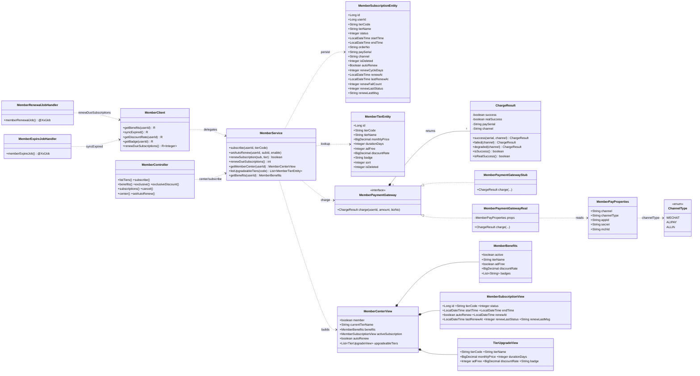
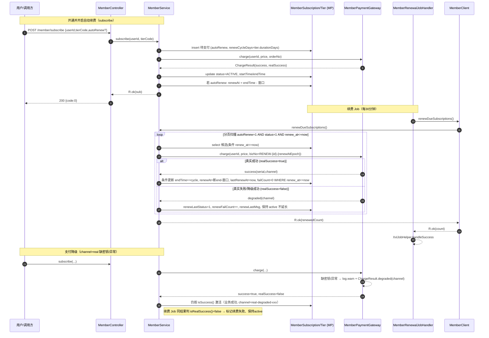

# 墨阅小说网 · P2-B 会员体系完整版 — 系统设计 + 任务分解

> 作者：高见远（software-architect）｜基础：既有 P2-B 订阅/会员体系（V23 落库、Stub 网关、@RequiresMember 拦截、MemberClient 跨域适配、MemberExpireJobHandler）。
> 本文仅做设计，不写业务代码。配套图见 `docs/class-diagram.mermaid`、`docs/sequence-diagram.mermaid`。

---

## 1. 实现方案概述

P2-B 在既有「开通—支付—权益—到期降级」闭环之上补三块能力：**连续订阅（自动续费）** 给 `member_subscription` 增加 `auto_renew / renew_at / renew_cycle_days / renew_fail_count` 等字段，并在**原记录上「延长 endTime」**实现整期续费（不新建续费流水表，保证幂等）；**支付网关可插拔骨架** 沿用 `MemberPaymentGateway` 接口，新增 `MemberPaymentGatewayReal`（`@ConditionalOnProperty channel=real`，内部按 `MOYUE_MEMBER_PAY_CHANNEL_TYPE` 分支微信/支付宝/通联占位，缺密钥或失败在网关内降级为「成功但标记真实失败」以不阻断主流程）；**会员中心 / 续费可见性** 由 `MemberService` 聚合 `getBenefits` + 生效订阅 + 可升级套餐，新增 `GET /member/center` 与自动续费开关接口；定时续费由新增 `MemberRenewalJobHandler`（`@XxlJob memberRenewalJob`）经 `MemberClient` 调 `memberService.renewDueSubscriptions`，逐条 try/catch 不抛未捕获。全量复用 `R<T>`、`@TableLogic`、Flyway 幂等迁移、H2 集成测试范式，不回退已落地结构。

---

## 2. 框架选型

- **Spring Boot 2.x（既有）+ MyBatis-Plus**（`@TableLogic` 逻辑删除、`BaseMapper` 条件更新）。
- **XXL-Job**（既有 `XxlJobConfig`，复用 `appname=moyue-job` 执行器，新增 `@XxlJob` 注解 Handler）。
- **Flyway**（V25 幂等 ALTER，复用 `tools/gen-h2-schema.py` 重生成 H2 schema）。
- **测试**：JUnit5 + AssertJ + Mockito（单测）+ `@SpringBootTest @ActiveProfiles("test")` + H2（集成）。
- **无新增 Maven 依赖**。可选新增一个配置类 `MemberPayProperties`（`@ConfigurationProperties(prefix="moyue.member.pay")`）承载渠道配置——属「可选配置类」，不引入新依赖。

---

## 3. 文件列表

### 3.1 源文件（相对 `moyue-app/`）

| 文件 | 动作 | 说明 |
|---|---|---|
| `src/main/resources/db/migration/V25__member_auto_renew.sql` | 新增 | 幂等 ALTER 给 `member_subscription` 加续费字段 + 联合索引 |
| `src/main/java/com/moyue/member/entity/MemberSubscriptionEntity.java` | 修改 | 新增 `autoRenew / renewCycleDays / renewAt / lastRenewAt / renewFailCount / renewLastStatus / renewLastMsg`；`isDeleted` 加 `@TableLogic(value="0",delval="1")` |
| `src/main/java/com/moyue/member/client/MemberPaymentGateway.java` | 修改 | `ChargeResult` 增 `realSuccess` 字段 + `degraded(channel)` 工厂；新增 `ChannelType` 枚举（WECHAT/ALIPAY/ALLIN） |
| `src/main/java/com/moyue/member/client/MemberPaymentGatewayReal.java` | 新增 | `@ConditionalOnProperty(channel=real)`，按 `ChannelType` 分支调占位 adapter；缺密钥/失败→降级成功（`realSuccess=false`）+ 记 warn |
| `src/main/java/com/moyue/member/client/MemberPaymentGatewayStub.java` | 不改 | 保持 `@Primary` + `stub` 缺省 |
| `src/main/java/com/moyue/member/config/MemberPayProperties.java` | 新增 | `@ConfigurationProperties(prefix="moyue.member.pay")`，绑定 channel / channelType / appId / secret / mchId（来自 `MOYUE_MEMBER_PAY_*`） |
| `src/main/java/com/moyue/member/service/MemberService.java` | 修改 | 新增 `setAutoRenew`、`renewSubscription(逐条)`、`renewDueSubscriptions(分页扫描)`、`getMemberCenter`、`listUpgradeableTiers`；新增内部视图类 `MemberCenterView / MemberSubscriptionView / TierUpgradeView`；续费 bizNo 规则 |
| `src/main/java/com/moyue/member/controller/MemberController.java` | 修改 | 新增 `GET /member/center`、`POST /member/subscriptions/{id}/auto-renew` |
| `src/main/java/com/moyue/api/member/client/MemberClient.java` | 修改 | 新增 `renewDueSubscriptions()` 跨域接缝（`SERVICE_DEGRADED` 降级） |
| `src/main/java/com/moyue/job/handler/MemberRenewalJobHandler.java` | 新增 | `@XxlJob("memberRenewalJob")`，调 `MemberClient.renewDueSubscriptions`，单条失败不阻断 |

### 3.2 测试文件（相对 `moyue-app/`）

| 文件 | 动作 | 说明 |
|---|---|---|
| `src/test/java/com/moyue/member/MemberRenewalFlowTest.java` | 新增 | H2 集成：续费**成功**路径（endTime 延长、failCount 清零、renewAt 前移）+ 续费**失败**路径（保持 active、renewLastStatus=1、failCount++、不延长） |
| `src/test/java/com/moyue/member/MemberCenterTest.java` | 新增 | H2 集成：中心视图聚合正确、自动续费开关置位 + renewAt 计算、订阅历史含续费可见字段 |
| `src/test/java/com/moyue/member/client/MemberPaymentGatewayRealTest.java` | 新增 | 单测（Mockito）：缺密钥→降级成功（`realSuccess=false`）；`channelType` 分支命中对应占位；异常→降级成功 |
| `src/test/java/com/moyue/api/member/client/MemberClientRenewTest.java` | 新增 | 单测：`renewDueSubscriptions` 委托 + 异常降级 `SERVICE_DEGRADED` |

### 3.3 配置 / 资源

| 文件 | 动作 | 说明 |
|---|---|---|
| `src/main/resources/application.yml` | 修改 | `moyue.member.pay.channel: ${MOYUE_MEMBER_PAY_CHANNEL:stub}` + env 占位说明（`MOYUE_MEMBER_PAY_CHANNEL_TYPE/APP_ID/SECRET/MCH_ID`） |
| `src/test/resources/db/h2/V1__h2_schema.sql` | 重生成 | V25 入库后执行 `python tools/gen-h2-schema.py` 重生成，保证 H2 等价 schema 含新列 |

### 3.4 Flyway V25 说明（幂等 + H2 重生成）

- 采用与 **V18/V19 一致**的幂等 ALTER 惯用法：`information_schema` 判列存在 → `SET @sql := IF(@exist=0, 'REAL DDL','SELECT 1')` → `PREPARE/EXECUTE/DEALLOCATE`。`tools/gen-h2-schema.py` 的 `PROC_IF` 正则会抽取 then 分支真实 DDL 直发 H2（H2 库每次新建列必不存在），故 H2 自动获得新列、生产库幂等可重复执行。
- 新增列：`auto_renew TINYINT(1) NOT NULL DEFAULT 0`、`renew_cycle_days INT NOT NULL DEFAULT 30`、`renew_at DATETIME DEFAULT NULL`、`last_renew_at DATETIME DEFAULT NULL`、`renew_fail_count INT NOT NULL DEFAULT 0`、`renew_last_status TINYINT DEFAULT NULL`、`renew_last_msg VARCHAR(255) DEFAULT NULL`。
- 索引：扫描用 `status + auto_renew + renew_at` 联合，新增 `KEY idx_member_sub_renew (status, auto_renew, renew_at)`（同样走 `PROC_IF` 幂等 `ADD INDEX`）。

---

## 4. 数据结构 / 接口

### 4.1 `member_subscription` 新增字段

| 列 | 类型 | 默认 | 说明 |
|---|---|---|---|
| `auto_renew` | TINYINT(1) | 0 | 自动续费开关 0否 / 1是 |
| `renew_cycle_days` | INT | 30 | 续费周期快照（subscribe 时取 `tier.durationDays`），续费延长按此值 |
| `renew_at` | DATETIME | NULL | 下次续费计划时刻 = `endTime − 窗口`（窗口 = `max(1, renew_cycle_days/3)` 天） |
| `last_renew_at` | DATETIME | NULL | 最近一次续费触发时刻 |
| `renew_fail_count` | INT | 0 | 续费连续失败次数 |
| `renew_last_status` | TINYINT | NULL | 最近续费结果 0成功 / 1失败 |
| `renew_last_msg` | VARCHAR(255) | NULL | 最近续费结果摘要（失败原因） |

已有字段不变；`isDeleted` 补 `@TableLogic(value="0",delval="1")`（全局未启用 logic-delete，须显式标注防物理删）。

### 4.2 `MemberCenterView`（P1-1 出参）

```
MemberCenterView {
  boolean member;                          // 是否生效中会员
  String currentTierName;                  // 当前等级(套餐名)，非会员 null
  MemberBenefits benefits;                 // 实时权益(复用 MemberService.MemberBenefits)
  MemberSubscriptionView activeSubscription; // 生效中订阅快照(含续费可见字段)，非会员 null
  boolean autoRenew;                       // 是否自动续费(activeSubscription!=null 时有效)
  List<TierUpgradeView> upgradeableTiers;  // 可升级套餐(同模块 sort 更高者)
}
MemberSubscriptionView { id, tierCode, tierName, status, startTime, endTime,
  autoRenew, renewAt, lastRenewAt, renewLastStatus, renewLastMsg }
TierUpgradeView { tierCode, tierName, monthlyPrice, durationDays, adFree, discountRate, badge }
```

### 4.3 `MemberPaymentGatewayReal` 接口签名

沿用 `MemberPaymentGateway` 接口（`charge` 方法不变）。新增：

- `ChargeResult.degraded(String channel)` 工厂：`success=true, realSuccess=false, channel="real-degraded-"+type`（替代原 `failed` → 用于「业务成功但真实失败」的降级语义）。
- `ChargeResult` 新增 `private boolean realSuccess = true;` + getter/setter；`success(serial,channel)` 保持 `realSuccess=true`；`failed(channel)` → `realSuccess=false`。
- `enum ChannelType { WECHAT, ALIPAY, ALLIN }`（也可置于 `MemberPayProperties`）。
- `MemberPaymentGatewayReal`（新增类）：
  - `@Component @ConditionalOnProperty(name="moyue.member.pay.channel", havingValue="real")`
  - 依赖 `MemberPayProperties`（注入 `appId/secret/mchId/channelType`）。
  - `ChargeResult charge(userId, amount, bizNo)`：
    - 若 `secret` 为空或 `channelType` 未配置 → `log.warn` + `ChargeResult.degraded(channelType)`（不抛）。
    - 否则按 `channelType` 调对应占位 adapter（`RealChannelAdapter` 内部接口或 `switch`）；占位实现在 P2-B 仅构造请求对象并抛 `UnsupportedOperationException`/或返回 `failed` → 捕获后 `log.warn` + `degraded(...)`。
    - 真实成功链路（P2-1 细化某家）才返回 `success(serial, channel)`。

### 4.4 JobHandler 方法签名

```java
@Component
public class MemberRenewalJobHandler {
  @Autowired(required=false) private MemberClient memberClient;
  @XxlJob("memberRenewalJob")
  public void memberRenewalJob() { /* 调 memberClient.renewDueSubscriptions()，失败记日志 handleSuccess 不阻断 */ }
}
```

`@XxlJob` value = `memberRenewalJob`（与既有 `memberExpireJob` 同执行器）。需在 XXL-Job Admin 注册 cron（建议每 30 分钟 `0 0/30 * * * ?`）。

### 4.5 关键 service 方法签名

```java
// 续费开关（校验本人 + 回写 renewAt）
void setAutoRenew(Long userId, Long subscriptionId, boolean enable);
// 续费单条（事务内）：charge + 条件更新；返回是否"真实成功"
boolean renewSubscription(MemberSubscriptionEntity sub, MemberTierEntity tier);
// 分页扫描并续费"到期窗口内、生效中且已开自动续费"的订阅；逐条 try/catch 不抛；返回续费成功数
int renewDueSubscriptions();
// 会员中心聚合
MemberCenterView getMemberCenter(Long userId);
// 可升级套餐（同模块 sort 高于当前档）
List<MemberTierEntity> listUpgradeableTiers(String currentTierCode);
```

### 4.6 类图（Mermaid）

见 `docs/class-diagram.mermaid`（已独立提取，亦内联如下）：



---

## 5. 调用流程（时序图）

### 5.1 连续订阅开通 → 续费 Job → 扣款 → 延长

见 `docs/sequence-diagram.mermaid`（内联如下）：



### 5.2 支付降级分支（要点）

- `subscribe` 走 `MemberPaymentGatewayReal` 时：缺密钥/调用异常 → 网关内 `log.warn` + 返回 `degraded`（`success=true, realSuccess=false`）→ `subscribe` 按 `isSuccess()` 判定激活（业务成功，渠道记 `real-degraded-xxx`）→ **不阻断**。
- 对续费 Job：同一 `degraded` 结果被 `renewSubscription` 判为「非真实成功」→ 标记续费失败、保持 active、不延长 endTime（符合 Q3）。

---

## 6. 任务列表（有序、含依赖，≤5 个）

| ID | 任务 | 依赖 | 涉及文件 | 验收点 |
|---|---|---|---|---|
| **T1** | **Schema / 实体 / H2 重生成**（P0-1 基础） | 无 | `V25__member_auto_renew.sql`、`MemberSubscriptionEntity.java`、重生成 `V1__h2_schema.sql` | 迁移幂等（重复执行无错）；H2 schema 含新列；实体新字段 + `@TableLogic`；`@SpringBootTest` 上下文可起 |
| **T2** | **支付网关可插拔骨架 + 配置降级**（P0-2） | 无（与 T1 并行） | `MemberPaymentGateway.java`（`ChargeResult.realSuccess`+`degraded`+`ChannelType`）、`MemberPaymentGatewayReal.java`、`MemberPayProperties.java`、`application.yml` | `channel=stub` 仍走 Stub（`@Primary`）；`channel=real` 时 Real 生效；缺密钥/异常→`degraded(realSuccess=false)` 不抛；`MemberPaymentGatewayRealTest` 通过 |
| **T3** | **连续订阅续费 Service + 开关**（P0-1） | T1, T2 | `MemberService.java`（新增 `setAutoRenew`/`renewSubscription`/`renewDueSubscriptions`）、`MemberClient.java`（续费接缝） | `renewSubscription` 集成覆盖成功与失败两路径；`setAutoRenew` 正确回写 `renewAt`；幂等（同周期不重复延长） |
| **T4** | **续费 JobHandler**（P0-1） | T3 | `MemberRenewalJobHandler.java` | `@XxlJob("memberRenewalJob")` 注册；调 `MemberClient.renewDueSubscriptions`；单条失败记日志 `handleSuccess` 不阻断；`MemberRenewalFlowTest` 覆盖两路径（经 service 直接验证，Job 自身轻量） |
| **T5** | **会员中心 + 续费可见性 + 解耦核查**（P1-1 / P1-2 / P2-2） | T1, T3 | `MemberService.java`（`getMemberCenter`/`listUpgradeableTiers`）、`MemberController.java`（`GET /member/center`、`POST /member/subscriptions/{id}/auto-renew`）、`MerchService` 等消费方核查（只读） | `/member/center` 聚合正确、子项失败降级不阻断；开关接口回写 `renewAt`；`MemberCenterTest` 通过；订阅历史含续费可见字段；grep 确认无新增 points/结算耦合 |

> 注：任务总数严格 ≤5（系统硬上限）。T5 合并了 P1-1（中心）、P1-2（可见性/开关）、P2-2（解耦核查）三块，因后者为「只读核查 + 经既有 MemberClient 留接缝」，无需独立大任务。

---

## 7. 依赖包

**基本无新增 Maven 依赖。** 复用既有：`spring-boot-starter` / `mybatis-plus-boot-starter` / `xxl-job-core` / `flyway-core` / `h2`（test）/ `assertj` / `mockito-junit-jupiter`。`MemberPayProperties` 用 Spring Boot 原生 `@ConfigurationProperties`，无需额外 starter。

---

## 8. 共享知识（跨文件约定）

- **renewAt 推进规则**：`renewAt = endTime − 窗口`；窗口 = `max(1, renewCycleDays/3)` 天（整数天，向下取整后至少 1）。`subscribe` 开自动续费时按此计算；`renewSubscription` 成功后 `renewAt = 新 endTime − 窗口`。
- **续费周期**：按整期续（延长 `renewCycleDays` 天，= subscribe 时快照的 `tier.durationDays`），不按比例。
- **幂等关键**：
  - 主扫描条件：`auto_renew=1 AND status=1 AND renew_at <= now AND is_deleted=0`。`renewAt` 在成功续费后前移过 now，天然同周期不重复入选。
  - 扣款 bizNo 规则：`RENEW-{subscriptionId}-{renewAtEpoch秒}`，供真实网关侧幂等去重（防 Job 重复执行双扣）。
  - 延长用条件更新：`UPDATE ... SET endTime=endTime+cycle, renew_at=?, last_renew_at=now, renew_fail_count=0 WHERE id=? AND status=1 AND auto_renew=1 AND renew_at <= now`（乐观，0 行则跳过）。
- **@XxlJob value**：`memberRenewalJob`（续费）、既有 `memberExpireJob`（到期降级）同执行器 `appname=moyue-job`；cron 续费建议 `0 0/30 * * * ?`，到期建议 `0 0 3 * * ?`。
- **配置项命名**：主开关 `moyue.member.pay.channel`（`stub|real`，缺省 `stub`）；真实渠道 `moyue.member.pay.channel-type`（`WECHAT/ALIPAY/ALLIN`）；密钥走环境变量 `MOYUE_MEMBER_PAY_CHANNEL_TYPE` / `MOYUE_MEMBER_PAY_APP_ID` / `MOYUE_MEMBER_PAY_SECRET` / `MOYUE_MEMBER_PAY_MCH_ID`（与既有 `MOYUE_JWT_SECRET` / `MOYUE_INTERNAL_TOKEN` 同风：yml 用 `${ENV:默认值}`，密钥类不留明文）。
- **ChargeResult 语义约定**：`success=true & realSuccess=true` = 真实扣款成功；`success=true & realSuccess=false` = 网关降级（缺密钥/调用失败但业务放行）；`success=false` = 网关判定失败（Stub 不会返回）。`subscribe` 只看 `isSuccess()`；续费 Job 额外看 `isRealSuccess()` 决定是否延长。
- **降级不阻断**：`subscribe` 真实渠道降级仍激活（业务成功 + 记 warn）；续费 Job 单条失败仅标记 `renewalFailed`、保持 active、不抛未捕获、不波及其他订阅；Job Handler 层 catch 后 `XxlJobHelper.handleSuccess` 保证调度成功。
- **统一响应 R<T>**：所有 Controller 返回 `R.ok` / `R.fail(ResultCode)`；续费状态经 `renewLastStatus/msg` 透出，不引入新业务码。
- **@TableLogic**：`member_subscription.isDeleted` 显式标注，防止退化为物理 DELETE（对齐全局未启用 logic-delete 的项目约定）。
- **H2 同步**：每次改 V 迁移后必跑 `python tools/gen-h2-schema.py` 重生成 `src/test/resources/db/h2/V1__h2_schema.sql`，否则集成测试缺列失败。

---

## 9. 待明确事项（对 PRD 4 问的建议结论）

1. **自动续费周期与临期窗口** → 采纳建议：按 `tier.durationDays` 整期续（延长快照 `renewCycleDays` 天）；扫描窗口 = 到期前 `max(1, renewCycleDays/3)` 天；`renewAt = endTime − 窗口`。在 `member_subscription` 落 `renewCycleDays` 快照（subscribe 时写入），避免 tier 后续编辑导致已订阅用户周期漂移。
2. **真实渠道优先** → 采纳建议：单一 `MemberPaymentGatewayReal` 抽象 + `ChannelType` 分支（微信/支付宝/通联共用骨架，P2-B 仅占位 adapter，P2-1 再细化某家真实对接）；环境变量 `MOYUE_MEMBER_PAY_CHANNEL_TYPE/APP_ID/SECRET/MCH_ID` 占位；由 `moyue.member.pay.channel=real` 激活，`channel=stub`（缺省）走桩。
3. **降级策略** → 采纳建议：`subscribe` 主流程真实渠道失败 → 网关内降级为「成功但 `realSuccess=false`」(business 放行 + `log.warn`)，不阻断开通；自动续费 Job 真实失败（含降级成功）→ 该订阅标记 `renewLastStatus=1`、`renewFailCount++`、保持 `status=1`(active)、不延长 `endTime`、记失败原因，不波及其他订阅；失败不抛未捕获。
4. **解耦幅度** → 采纳建议：仅做核查 + 必要处经 `MemberClient` 留接缝（已具备 `getBenefits/syncExpired/getDiscountRate/getBadge` + 本次新增 `renewDueSubscriptions`），**不修改** points / 稿酬结算（`PayChannelGateway`）调用方签名；自动续费 Job 不触碰 points/结算；已核查确认 `MerchService`（商城结算折扣）等消费方**仅经 `MemberClient.getBenefits/getDiscountRate` 调用**，`getBenefits` 已与结算解耦（`MemberClient` 自带 `SERVICE_DEGRADED` 降级），无新增强耦合。
