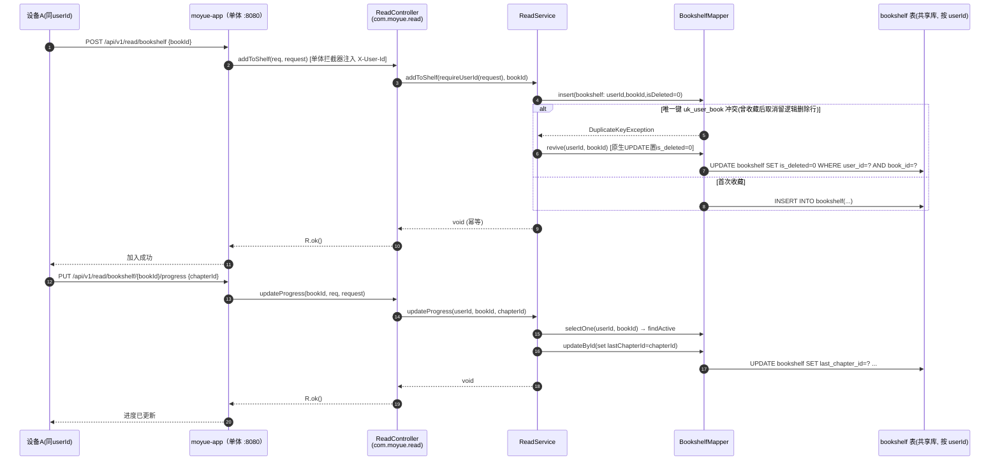
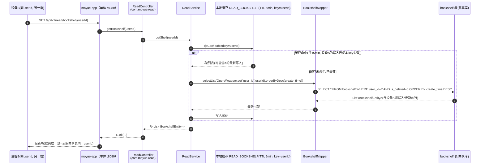
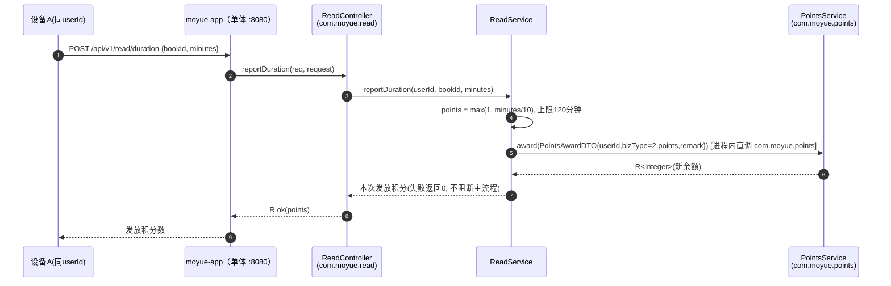

# 时序图 · 书架同步（跨端 / 跨设备）

> ⚠️ **历史设计稿（拍平前微服务架构）**：本图描述的是重构为单体之前的微服务拓扑（`moyue-gateway` / Nacos / Feign / 多模块）。当前已统一为单 `moyue-app` 单体（Spring Boot，端口 :8080）：图内 `moyue-xxx` 服务名即单体内的业务包（如 `com.moyue.read`），跨域调用为进程内 `@Service` 注入，已无网关 / Nacos / Feign；`X-User-Id` 现由单体拦截器自 JWT 注入。下文保留作历史参考。

> 业务包：`com.moyue.read`（ReadController / ReadService / BookshelfEntity / BookshelfMapper，单体 `moyue-app` 内，原 `moyue-content` 模块）。
> 阅读说明：**本时序图全部为已读源码确认的真实代码路径**。本服务**没有**显式的实时推送 / Redis 发布订阅 / 账户服务同步机制——"跨端同步"在现有实现中是通过**共享 per-user 数据表 + 单体拦截器注入的同一 `X-User-Id` + 拉取时读取最新行**隐式达成的（详见文末 Caption）。仅 `reportDuration` 存在真实的进程内 `PointsService` 调用。

## 真实路径：写入书架 / 更新进度（设备 A）

## 真实路径：其他端拉取最新书架（设备 B，即"同步"）

> 说明：设备 A 写入后 `ReadService` 用 `@CacheEvict(cacheNames=READ_BOOKSHELF, key=userId)` 失效了**该 userId** 的缓存，因此设备 B（同一 userId）下一次 `getShelf` 会回源数据库读到 A 的最新数据——这就是"同步"的实现方式：**无推送，拉取即一致**。

## 真实路径：阅读时长上报（唯一真实进程内跨包调用）

> 真实方法名（已核实）：
> - `ReadController.reportDuration(@RequestBody DurationRequest, HttpServletRequest)` → `ReadService.reportDuration(Long userId, Long bookId, Integer minutes)`。
> - `ReadService.reportDuration` 内：`PointsService.award(PointsAwardDTO)` —— `com.moyue.points.PointsService`（`@Service` 进程内注入），目标端点 `POST /api/v1/internal/points/award`（单体内部端点，不经网关），bizType=2（阅读时长奖励）。积分服务不可用时仅记 warn 返回 0，**不阻断阅读主流程**（旁路奖励）。
> - `ReadService` 注入 `PointsService` 用 `@Autowired(required=false)`，故 read 包未引 points 包时该字段为 null，调用前判空。

---

### Caption（关键说明 / 假设）

1. **无显式跨端同步机制**：现有 `com.moyue.read` 代码中**不存在** WebSocket 推送、Redis 发布/订阅、或调用账户服务做多端同步的逻辑。跨设备一致性完全依赖：① 书架数据按 `userId` 存于**共享数据库**；② 单体拦截器为所有端的同一用户注入同一个 `X-User-Id` 头；③ 取书架是**拉取式** `getBookshelf(userId)`，读到的是该 userId 的最新行。即"同步 = 打开书架时读取共享表"。
2. **缓存导致的短暂不一致**：`getShelf` 有 `@Cacheable(READ_BOOKSHELF, TTL=5min, key=userId)`，写操作会 `@CacheEvict` 同 userId 缓存。若设备 B 在 5 分钟缓存窗口内且未触发任何写（不会自动失效），则最长可能看到 **≤5 分钟**的陈旧数据；设备 A 的写入会使 A 侧缓存即时失效，但**不会主动通知 B**。这是当前实现已知的同步延迟上限（设计观察，非缺陷）。
3. **幂等加书架**：`uk_user_book(user_id, book_id)` 唯一键 + 逻辑删除导致"收藏→取消→再收藏"撞键，`addToShelf` 用"insert 失败则 `revive` 原生 UPDATE"保证幂等（绕过 MP 逻辑删除过滤）。
4. **userId 不信任前端**：所有写接口（加书架/进度/时长）的 userId 一律取单体拦截器注入的 `X-User-Id`（`Constants.USER_ID_HEADER`），只读接口 `getBookshelf` 的 userId 来自路径参数（属作者/读者自身数据查询，由上层业务保证授权）。
5. **真实进程内跨包调用**：仅 `ReadService → PointsService.award`（进程内直调 `com.moyue.points` 内部积分）。图中的 `PointsService` 即该进程内服务（实际为 `com.moyue.points` 的积分服务），非 read 包内部类。
