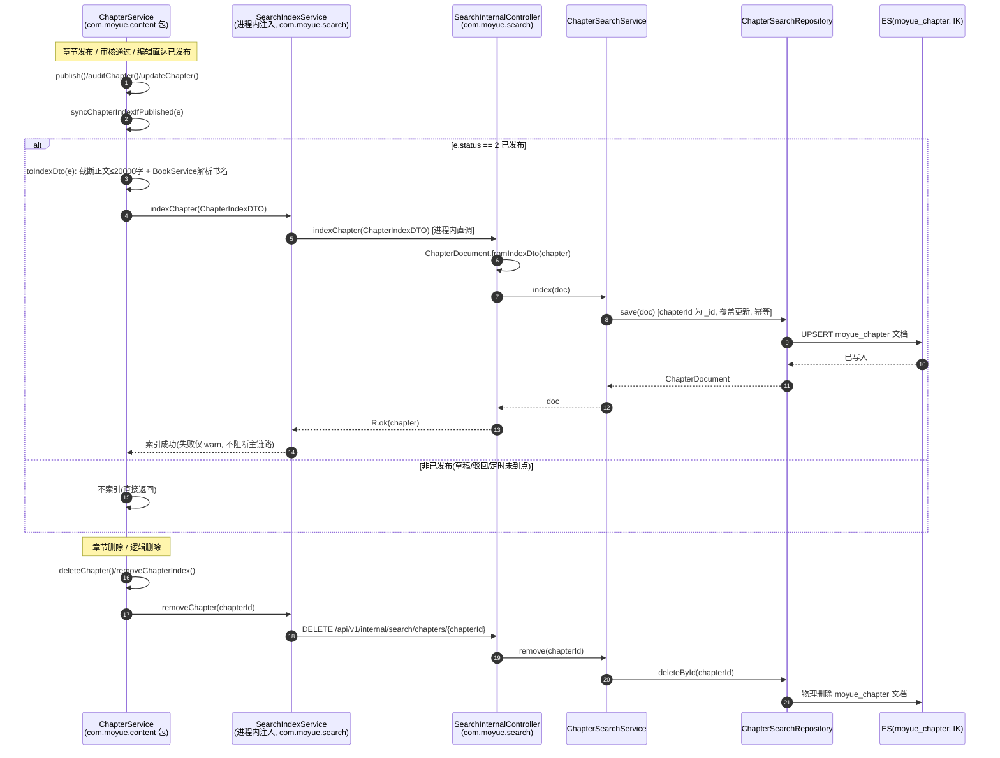
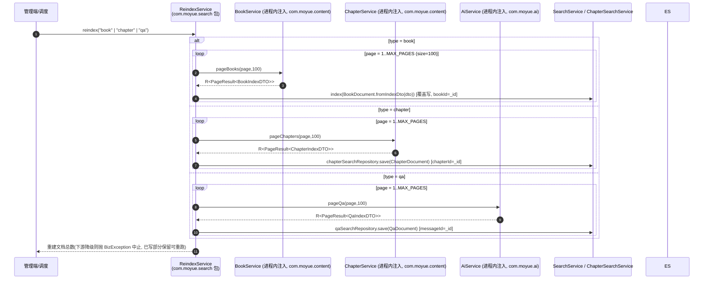

# 时序图 · 搜索推荐

> ⚠️ **历史设计稿（拍平前微服务架构）**：本图描述的是重构为单体之前的微服务拓扑（`moyue-gateway` / Nacos / Feign / 多模块）。当前已统一为单 `moyue-app` 单体（Spring Boot，端口 :8080）：图内 `moyue-xxx` 服务名即单体内的业务包（如 `com.moyue.search`），跨域调用为进程内 `@Service` 注入，已无网关 / Nacos / Feign。下文保留作历史参考。

> 业务包：`com.moyue.search`（SearchController / SearchService / ChapterSearchService / RecommendService / SearchInternalController / ReindexService）+ 内容域增量索引链路（`com.moyue.content` 的 ChapterService 经进程内 SearchIndexService 写 ES，原 Feign SearchIndexClient）。
> 阅读说明：**以下全部为已读源码确认的真实代码路径**。索引库为 `moyue_book` / `moyue_chapter` / `moyue_qa`（IK 分词），均经 Spring Data Elasticsearch `ElasticsearchOperations` / Repository 访问。

## 真实路径一：书籍 / 章节检索 + 推荐（用户侧）

```mermaid
sequenceDiagram
    autonumber
    participant U as 用户客户端
    participant GW as moyue-app（单体 :8080）
    participant SC as SearchController<br/>(com.moyue.search)
    participant SS as SearchService
    participant CSS as ChapterSearchService
    participant RS as RecommendService
    participant EO as ElasticsearchOperations
    participant ES as ES(moyue_book /<br/>moyue_chapter, IK分词)

    U->>GW: GET /api/v1/search/books?keyword=&categoryId=&sort=
    GW->>SC: searchBooks(keyword,categoryId,sort,page,size)
    SC->>SS: search(keyword,categoryId,sort,page,size)
    SS->>SS: 构建 NativeQuery: multiMatch(title^3,authorName^2,<br/>categoryName,description) minimumShouldMatch=75%
    SS->>SS: filter: status∈{1连载,2已完结}(filter context, 可缓存)<br/>+ 可选 categoryId term
    SS->>EO: search(NativeQuery, BookDocument.class)
    EO->>ES: 全文检索(查询侧 ik_smart)
    ES-->>EO: SearchHits<BookDocument>
    EO-->>SS: hits
    SS-->>SC: PageResult<BookDocument>(relevance/hot/latest 排序)
    SC-->>GW: R.ok(...)
    GW-->>U: 书籍检索结果

    U->>GW: GET /api/v1/search/chapters?keyword=&bookId=
    GW->>SC: searchChapters(keyword,bookId,page,size)
    SC->>CSS: search(keyword,bookId,page,size)
    CSS->>CSS: 构建 NativeQuery: multiMatch(chapterTitle^2,content)<br/>filter: status=2 已发布 + 可选 bookId
    CSS->>CSS: withHighlightQuery(<em>标签, fragmentSize=150, noMatchSize=100)
    CSS->>EO: search(NativeQuery, ChapterDocument.class)
    EO->>ES: 章节全文检索 + 正文高亮
    ES-->>EO: SearchHits<ChapterDocument>(含 highlight)
    EO-->>CSS: hits
    CSS-->>SC: PageResult<ChapterSearchResultDTO>(含高亮片段)
    SC-->>GW: R.ok(...)
    GW-->>U: 章节检索结果(高亮)

    U->>GW: GET /api/v1/search/recommend?limit=&sort=
    GW->>SC: recommend(limit,sort)
    SC->>RS: recommend(limit,sort)
    RS->>RS: Criteria(status).in(1,2); sort=hot→hotScore desc / latest→updateTime desc
    RS->>EO: search(CriteriaQuery, BookDocument.class, TopN)
    EO->>ES: 取 status∈{1,2} TopN
    ES-->>EO: hits
    EO-->>RS: List<BookDocument>
    RS-->>SC: 推荐书籍列表
    SC-->>GW: R.ok(...)
    GW-->>U: 推荐位
```

## 真实路径二：内容发布 / 审核触发增量索引同步（internal API → ES）

> 关键点：`/api/v1/internal/**` 为单体内部端点（不经网关，单体已无网关），由 `com.moyue.content` 经进程内 SearchIndexService 直调。



> 真实方法名（已核实）：
> - 触发：`ChapterService.publish()` / `auditChapter()` / `updateChapter()` 末尾调用 `syncChapterIndexIfPublished(ChapterEntity e)`；仅 `e.getStatus()==2(已发布)` 时调 `searchIndexService.indexChapter(toIndexDto(e))`，否则跳过。`searchIndexService` 为 `@Autowired(required=false)`，search 包未注册时安全降级（仅 warn）。
> - `toIndexDto`：正文超 20000 字符截断（`CONTENT_INDEX_MAX`），书名经 `BookService.getBook` 解析（不可用时空串兜底）。
> - 接收端：`SearchInternalController.indexChapter(@RequestBody ChapterIndexDTO)` → `ChapterDocument.fromIndexDto` → `ChapterSearchService.index` → `chapterSearchRepository.save`（chapterId 为 ES `_id`，幂等覆盖）。
> - 进程内链路：`com.moyue.search.SearchIndexService`（`@Service` 进程内注入），端点 `POST /api/v1/internal/search/chapters/_index`（单体内部端点）。书籍索引 `indexBook`、问答索引 `indexQa` 机制完全对称（分别来自 `com.moyue.content` 的书籍发布与 `com.moyue.ai` 的对话落库）。

## 真实路径三：管理端全量重建索引（ReindexService 经进程内 Service 分页拉取）



> 真实方法名（已核实）：`ReindexService.reindex(String type)` → `reindexBooks()` / `reindexChapters()` / `reindexQa()`，分别经 `BookService.pageBooks` / `ChapterService.pageChapters` / `AiService.pageQa`（均为 `@Service` 进程内注入，分页 size=100，最大 10000 页护栏）拉取全量索引载荷，逐条 `fromIndexDto` → `save` 覆盖写入对应索引（bookId/chapterId/messageId 为 `_id`，天然幂等）。下游 fallback（R.code=40002）或异常时抛 `BizException` 中止，已写入部分不受影响。

---

### Caption（关键说明 / 假设）

1. **索引库与分词**：`moyue_book` / `moyue_chapter` / `moyue_qa` 三套索引，均启用 IK 分词（查询侧 `ik_smart`）；书籍 `multi_match` 字段权重 `title^3 > authorName^2 > categoryName/description`，章节 `chapterTitle^2 > content`。状态白名单（书籍 `status∈{1,2}`、章节 `status=2`）置于 bool **filter context**（不计分且可被 ES 节点级 filter cache 复用）。
2. **内部端点不经网关**：`SearchInternalController` 的 `/api/v1/internal/search/**` 由内容域 / AI 域进程内直调（`com.moyue.search`），不经网关（单体已无网关）；单体路由直接暴露 `/api/v1/search/**`、`/api/v1/admin/search/**`。因此时序图二中 `SearchIndexService → SearchInternalController` 之间无网关节点。
3. **高亮**：章节检索对 `content` 字段高亮，标签 `<em>`/`</em>`，`fragmentSize=150`、`noMatchSize=100`，经 `ChapterSearchResultDTO.from(hit)` 携带高亮片段返回。
4. **降级与幂等**：增量索引（路径二）进程内调用失败仅记 warn、不阻断章节发布主流程；全量重建（路径三）下游不可用时中止但已写部分可重跑。所有索引写入以业务主键为 `_id`，重复推送覆盖更新（幂等），与删除（物理删 `_id`）配合保证最终一致。
5. **真实进程内跨包调用**：路径二 `ChapterService → SearchIndexService`（`com.moyue.search`）；路径三 `ReindexService → BookService / ChapterService / AiService`（`com.moyue.content` / `com.moyue.ai`）。其中 `BookService`/`ChapterService` 亦被内容域自身与 `com.moyue.system` 的 `RewardService`（解析书籍作者）复用。
6. **未涉及假设**：本图全部为现存代码路径，无假设环节。`SearchInternalController` 的书籍索引由 `com.moyue.content` 书籍发布/下架触发（与章节对称，机制同路径二），`indexQa` 由 `com.moyue.ai` 每轮对话落库后触发，文中以"机制对称"说明，未逐条展开。
