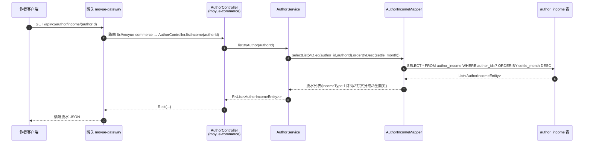
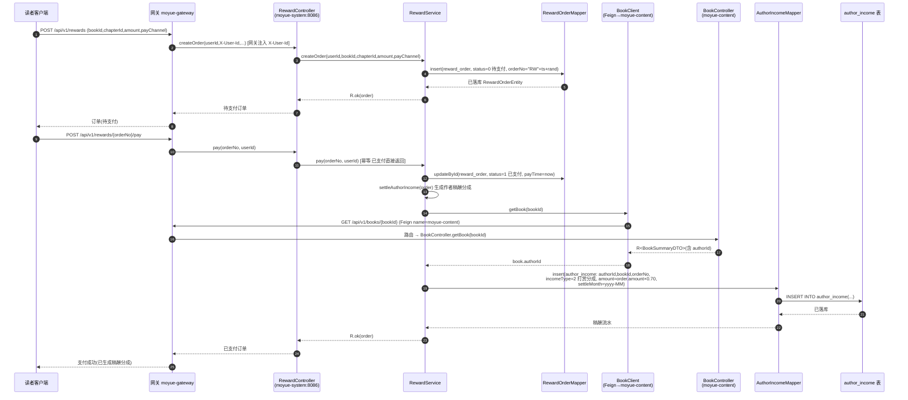
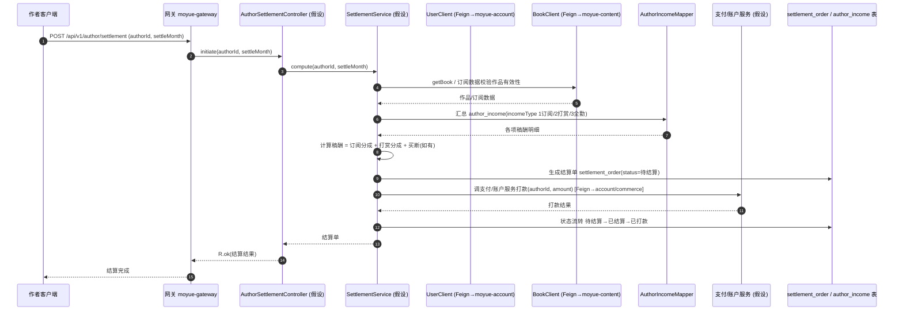

# 时序图 · 稿酬结算

> 模块：稿酬 = `moyue-commerce` 的 `com.moyue.author`（作者稿酬查询桩） + `moyue-system` 的 `com.moyue.operation`（打赏支付与稿酬分成实际落库）。
> 阅读说明：**蓝色实线框内的调用链是已读源码确认的真实代码路径**；**红色虚线框内为"作者主动发起结算"的目标流程，当前代码尚未实现，属设计假设**（详见文末 Caption）。

## 真实路径一：作者查询稿酬流水（moyue-commerce `com.moyue.author`）

> 真实方法名（已核实）：`AuthorController.listIncome(@PathVariable Long authorId)` → `AuthorService.listByAuthor(Long)` → `AuthorIncomeMapper.selectList(Wrappers.lambdaQuery().eq(AuthorIncomeEntity::getAuthorId, authorId).orderByDesc(AuthorIncomeEntity::getSettleMonth))`。

## 真实路径二：打赏支付触发稿酬分成结算（moyue-system `com.moyue.operation`）

> 真实方法名（已核实）：
> - `RewardController.create(@RequestBody CreateRewardRequest, HttpServletRequest)` → `RewardService.createOrder(Long userId, Long bookId, Long chapterId, BigDecimal amount, Integer payChannel)`
> - `RewardController.pay(@PathVariable orderNo, HttpServletRequest)` → `RewardService.pay(String orderNo, Long userId)` → 内部 `settleAuthorIncome(RewardOrderEntity)` → `resolveAuthorId(Long bookId)` 经 `BookClient.getBook(bookId)`（Feign `@FeignClient(name="moyue-content")`）→ `AuthorIncomeMapper.insert(...)`。
> - 分成规则：作者分成比例 `AUTHOR_SHARE_RATIO = 0.70`；`incomeType=2` 为打赏分成；`orderNo` 同时是支付幂等键。
> - **跨服务调用（真实 Feign）**：`RewardService` → `BookClient.getBook` → `moyue-content` `BookController.getBook`。这是本链路唯一的跨服务调用。

## 设计假设路径三：作者主动发起结算单 + 打款（当前未实现）

> 以下为**目标态设计假设**：当前 `com.moyue.author` 仅是查询桩，`moyue-system.operation` 也只对"打赏分成"自动落库，**不存在**"订阅分成 / 买断 / 结算单 / 待结算→已结算→已打款 状态机 / 调支付或账户打款"代码。该段仅用于对齐后续实现，方法名为建议命名。

---

### Caption（关键说明 / 假设）

1. **真实代码边界**：本仓库"稿酬结算"的真实落库仅发生在 `moyue-system.com.moyue.operation.RewardService.settleAuthorIncome`——**且仅覆盖"打赏分成（incomeType=2，比例 70%）"**，由读者打赏支付成功时自动触发。订阅分成、买断、作者主动发起结算单、打款状态机（待结算/已结算/已打款）**均未实现**。
2. **两张 `AuthorIncomeEntity`**：`moyue-commerce.com.moyue.author.entity.AuthorIncomeEntity` 与 `moyue-system.com.moyue.operation.entity.AuthorIncomeEntity` 都映射同一张 `author_income` 表——前者只读（查询桩 `AuthorController`），后者（在 operation 包）负责写（打赏分成落库）。这是跨服务的**共享表**依赖，非 Feign 调用。
3. **跨服务调用（真实）**：仅 `RewardService → BookClient.getBook(bookId)`（Feign，name=`moyue-content`）用于解析书籍作者 ID。commerce 的 `com.moyue.author` 模块**未引入** `moyue-api-account`/`moyue-api-content`，因此"调用支付/账户"在真实代码中并不存在（属假设路径三）。
4. **userId 来源**：打赏与查询均取网关注入的 `X-User-Id` 请求头（`Constants.USER_ID_HEADER`），不信任请求体，与全站约定一致。
5. **假设路径三**的方法名（AuthorSettlementController / SettlementService / settlement_order 表 / 调支付或账户服务）为建议命名，待后续需求确认后实现。
