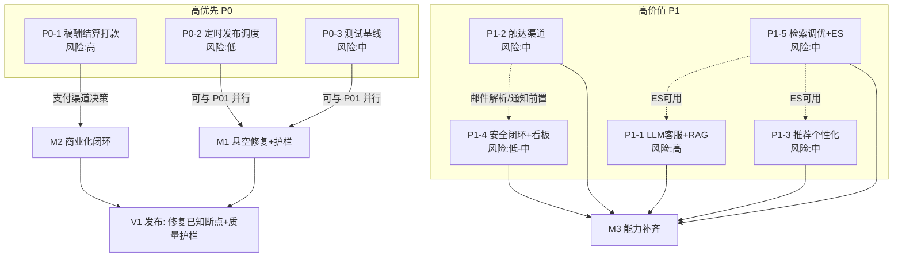

# 墨阅小说网（moyue-parent）P0 / P1 可执行实现计划

> **本计划基于截至 2026-09-15 源码实际状态，配合 docs/项目现状与迭代计划.md 使用。**
> 所有改动点均经实地复读源码（Glob/Grep/Read）核实，落到具体类与方法；未做源码改动，仅产出文档。
> 技术基线：Spring Boot 3.2.12 + Spring Cloud 2023.0.5 + MyBatis-Plus；模块根 `moyue-modules/`，共享迁移库 `moyue-common/moyue-common-migration/src/main/resources/db/migration/`（Flyway 当前最新 **V15**）；Feign 契约在 `moyue-api/*`；XXL-Job 执行器在 `moyue-modules/moyue-system`。

---

## 0. 已核实的关键现状（写计划的根据）

| 项 | 实际源码位置 | 真实状态 |
|---|---|---|
| 打赏分成 | `moyue-system/.../operation/service/RewardService.java` `settleAuthorIncome()`（行 241） | 仅 `incomeType=2` 打赏分成 70% 落 `author_income`；`AUTHOR_SHARE_RATIO=0.70` 硬编码 |
| 作者稿酬（查询桩） | `moyue-commerce/.../author/service/AuthorService.java` `listByAuthor()` | 仅只读 `author_income`；无结算单/打款 |
| 共享表耦合 | `system/operation/entity/AuthorIncomeEntity` 与 `commerce/author/entity/AuthorIncomeEntity` **双映射同一张 `author_income`** | 非 Feign，跨服务直读同表（技术债） |
| 定时发布悬空 | `moyue-content/.../chapter/service/ChapterService.java` `publish()` 行 237 `// TODO`、行 238 置 `STATUS_REVIEWING(1)` | 无 JobHandler 接管；且 `STATUS_REVIEWING=1` 与人工审核状态**复用同一值**，存在语义混淆 |
| XXL-Job 现状 | `moyue-system/.../job/handler/{DemoJobHandler,MessageDispatchJobHandler}.java` | 仅有 `demoJobHandler`/`shardingJobHandler`/`statAggregateJobHandler`/`messageDispatchJob`，**无章节发布 Handler** |
| AI 回复引擎 | `moyue-ai/.../ai/engine/{AiReplyEngine,KeywordRuleReplyEngine}.java` | 纯 10 条关键字规则 + 兜底；**全仓无 LLM 客户端**；`AiReplyEngine.reply(String)` 无上下文/置信度入参 |
| 多轮上下文 | `moyue-ai/.../ai/service/AiService.java` `chat()` 行 92 `replyEngine.reply(content)` | 仅传当前内容，历史未拼入 prompt |
| RAG 数据基础 | `moyue-search/.../search/service/QaSearchService.java` `search()`（行 75） | `moyue_qa` 索引已有 `question/answer` multi_match 检索，可包装为召回 |
| 短信/推送桩 | `moyue-message/.../message/channel/{SmsChannelSender,PushChannelSender}.java` | 仅 `log.warn` + 返回 `pending` |
| 邮件解析恒 null | `moyue-message/.../message/channel/EmailChannelSender.java` `resolveEmail()` 行 71 | `UserDTO` 无 email 字段 → 恒返回 null |
| 用户资料缺字段 | `moyue-account/.../user/entity/UserEntity.java`、`moyue-api-account/.../dto/UserDTO.java`、`UserService.toDto()` | 均**无 email / deviceToken** |
| 分发器无 PUSH 目标 | `moyue-message/.../message/service/MessageDispatcher.java` `buildChannelMessage()` 行 115 | 仅 EMAIL/SMS 设 `target`，**PUSH 无 deviceToken 取值**；`MessageDispatchDTO` 无 `targetDeviceToken` |
| 审核裁决无通知 | `moyue-risk/.../audit/service/AuditService.java` `decide()` 行 79 | 回写业务状态后置 `FINISHED`，**不发任何通知** |
| 举报通知单向 | `moyue-risk/.../risk/report/ReportService.java` `handle()` 行 148 + `notifyReporter()` 行 225 | 仅通知举报人（REPORT_RESULT 模板），**不通知被处理内容 owner** |
| 机审结论 | `moyue-risk/.../risk/moderation/ModerationService.java` `DECISION_PASS/REVIEW/REJECT` | REJECT 抛异常阻断；REVIEW 写 `audit_task`；无通知 |
| 推荐仅排序 | `moyue-search/.../search/service/RecommendService.java` `recommend()` 行 49 | 仅 `status∈{1,2}` + `hotScore`/`updateTime` 排序，无画像/召回 |
| 检索字段加权 | `moyue-search/.../search/service/ChapterSearchService.java` `search()` 行 80 | `multiMatch(chapterTitle^2, content)`，已有基础加权；无同义词/纠错 |
| 索引重建 | `moyue-search/.../search/service/ReindexService.java` | 分页 Feign 拉取覆盖写入；依赖运行中 ES |
| 并发防超卖（真实） | `moyue-commerce/.../merch/service/MerchService.java` 行 204-215 | **条件原子更新** `stock=stock-qty WHERE status=1 AND stock>=qty`，超卖防护真实存在（P0-3 测试有价值） |
| 4 个 @Disabled 测试 | `content/read/BookshelfFlowTest`、`social/im/ImMessageFlowTest`、`social/blog/BlogLikeFlowTest`、`commerce/points/PointsOrderFlowTest` | 均 `@Disabled("禁用 Docker/Testcontainers")` + `MySQLContainer`+`@ServiceConnection` |
| H2 集成测试范本 | 全仓 Grep `h2` 仅命中上述 4 个 @Disabled 与 `moyue-system` 的 `QaV14/V15SqlParseTest`（纯 SQL 解析单测，**非 DB 集成**） | **无现成可用的 H2 集成测试范本**，需新建立 |

---

# P0-1 稿酬结算与打款闭环

## 1. 目标与验收标准
- **目标**：补全稿酬从「产生」到「作者可提现」的全链路——新增订阅分成/买断分成、结算单与状态机、平台审核与打款流水；把 `moyue-commerce` 的 `AuthorService` 由只读桩升级为可查询结算单/发起提现的结算服务。
- **验收标准（做完的判定）**：
  1. 订阅/买断行为发生时，按规则自动向 `author_income` 落入对应 `incomeType`（1 订阅 / 4 买断）流水，且幂等；
  2. 作者可在作者端发起结算单（聚合某区间 `author_income` → `settlement_order`），状态机 `待结算→已结算→已打款` 可流转且可重试/对账；
  3. 平台运营在管理端对结算单审核并执行打款，打款对接支付渠道并落流水，失败可重试；
  4. `AuthorService`（commerce 端）返回结算单与稿酬汇总，不再只是 `listByAuthor`。

## 2. 涉及模块 + 新增/修改文件清单
- **moyue-system（operation 已持 `reward_order`/`author_income` 表，是结算落库主属主）**
  - 【修改】`operation/service/RewardService.java`：保留 `settleAuthorIncome`（打赏 70%）；新增 `settleSubscriptionIncome(...)`、`settleBuyoutIncome(...)`；新增 `buildSettlement(userId, month)` 聚合逻辑（按 `author_income` 未结算流水生成结算单）。
  - 【修改】`operation/entity/AuthorIncomeEntity.java`：新增 `settlementId`（Long，关联 `settlement_order.id`，用于标记已纳入结算的流水，避免重复结算）。
  - 【新增】`operation/entity/SettlementOrderEntity.java`、`operation/mapper/SettlementOrderMapper.java`。
  - 【新增】`operation/service/SettlementService.java`：结算单创建/审核/打款状态机编排（含 `createSettlement`、`auditApprove`、`payout`、`retryPayout`、`markFailed`）。
  - 【新增】`operation/controller/SettlementController.java`：作者端 `POST /api/v1/settlements`（发起）、`GET /api/v1/settlements/mine`；管理端 `POST /api/v1/admin/settlements/{id}/audit`、`POST /api/v1/admin/settlements/{id}/payout`（需 `role=3`，沿用 `AdminRoleInterceptor`）。
  - 【新增】`operation/service/SettlementPayoutService.java` + `operation/client/PayChannelGateway.java`（支付渠道抽象，微信/支付宝适配）。
- **moyue-commerce（author 共享表，查询桩升级）**
  - 【修改】`author/service/AuthorService.java`：扩展为结算查询服务——`listByAuthor`（保留）、`listSettlements(userId)`、`getSettlement(id)`（读 `settlement_order` 共享表，需新增 commerce 侧 `SettlementOrderMapper` 映射同表，或改走 Feign 到 system）。
  - 【修改】`author/entity/AuthorIncomeEntity.java`（commerce 侧）：同步加 `settlementId` 字段保持一致。
  - 【修改】`author/controller/AuthorController.java`：新增结算单查询端点。
- **moyue-common-migration**
  - 【新增】`V16__settlement.sql`：`settlement_order` 表 + `author_income` 加 `settlement_id` 列。

## 3. 数据表 / Flyway 变更（**V16**）
- **新增表 `settlement_order`**（建议字段）：`id`(雪花)、`author_id`、`period`（结算月份或区间描述）、`total_amount`(DECIMAL)、`status`(TINYINT: 0 待结算 / 1 已结算待打款 / 2 已打款 / 3 打款失败)、`pay_channel`、`pay_serial`（渠道流水号）、`remark`、`operator_id`、`create_time`、`update_time`、`is_deleted`。
- **`author_income` 加列**：`settlement_id BIGINT NULL`（用于锁定已结算流水）。
- 不改 `reward_order`。**说明**：当前 `author_income` 无 `is_deleted` 列（与现有实体一致），新列同样不设逻辑删除。

## 4. 接口/契约变更
- 新增 `SettlementController` 端点（作者端 `/api/v1/settlements/**`、管理端 `/api/v1/admin/settlements/**`），springdoc 自动暴露 `/v3/api-docs`，**对 `moyue-contract` openapi-generator 无额外成本**（仅保证 DTO 注解完整）。
- 若 commerce 端改走 Feign 读结算单（推荐，收敛「双映射同表」技术债），需【新增】`moyue-api-system` 的 `SettlementClient` + Fallback；否则 commerce 侧直接映射 `settlement_order` 表（与现状一致，但不推荐）。
- 支付渠道抽象 `PayChannelGateway` 不跨服务，无契约影响。

## 5. 任务分解（有序，标注依赖）
- **T1.1**【数据层】编写 `V16__settlement.sql` + `SettlementOrderEntity`(system/commerce) + `SettlementOrderMapper`(system)；`AuthorIncomeEntity`(双侧) 加 `settlementId`。（前置：无；依赖支付渠道选型决策 T1.4）
- **T1.2**【分成引擎】`RewardService` 新增订阅/买断分成落库 `settleSubscriptionIncome`/`settleBuyoutIncome`，`incomeType` 扩展 1/4；订阅/买断数据源接入点待明确（见 §7）。（依赖 T1.1）
- **T1.3**【结算单状态机】`SettlementService` + `SettlementController`：作者发起→聚合未结算流水→`settlement_order`；状态机流转与幂等。（依赖 T1.1、T1.2）
- **T1.4**【打款】`SettlementPayoutService` + `PayChannelGateway` 实现（微信/支付宝），管理端 `payout` 接口 + 失败重试/对账。（依赖 T1.3；**硬依赖外部支付渠道决策与密钥**）
- **T1.5**【commerce 结算查询】`AuthorService` 扩展结算单查询 + `AuthorController` 端点（走 Feign 或共享表）。（依赖 T1.3）

## 6. 关键技术点与风险
- **外部依赖（高）**：支付渠道（微信/支付宝）需商户号、密钥、回调地址；打款多走「企业付款到零钱/批量转账」类接口，需资质与限额。
- **状态机幂等**：结算单与打款需以 `pay_serial`/订单号做幂等键，重复回调不重复打款；打款失败进入 `status=3` 可重试，重试前对账。
- **对账**：以 `reward_order`/`author_income` 为源，结算单为聚合结果；建议加每日对账 Job（可复用 XXL-Job）。
- **技术债收敛**：建议 T1.5 用 Feign（`SettlementClient`）替代 commerce 直读 `settlement_order` 表，消除双映射同表耦合（见现状 §0）。
- **风险等级：高**。

## 7. 待明确事项（须主人/PM 拍板）
1. **是否真要订阅分成？** 全仓 Grep `subscription/订阅` 无任何订阅域实现（仅 `AuthorIncomeEntity` 注释提及 `incomeType=1` 订阅）。订阅付费链路本身不存在——P0-1 若要做订阅分成，需先定义订阅/付费阅读域（可能并入 P2-4 会员体系）。**请确认本期只做「打赏+买断分成」还是一并补订阅域**。
2. **买断规则**：买断稿酬如何产生（编辑后台录入？买入价 × 比例？），比例与触发点。
3. **支付渠道选型**：微信 / 支付宝 / 复用 `moyue-commerce` 已有商城支付；企业付款资质与密钥由谁提供。
4. **分成比例配置化**：当前 70% 硬编码于 `RewardService.AUTHOR_SHARE_RATIO`，是否改为 `sys_config` 可运营配置（建议是）。
5. **结算周期**：按月自动生成结算单，还是仅作者主动发起（影响 T1.3 触发方式）。

---

# P0-2 章节定时发布调度闭环

## 1. 目标与验收标准
- **目标**：修复 `ChapterService.publish()` 悬空 TODO，新增 XXL-Job Handler 接管「定时待发布 → 已发布」状态流转并触发 ES 索引同步。
- **验收标准**：
  1. 作者设 `publishTime` 在未来 → 章节落库 `status` 为**专定时待发布态**（不与人工审核混淆）；
  2. XXL-Job 到点扫描 → 置 `status=2 已发布` 并调用 `syncChapterIndexIfPublished` 入 ES 索引；
  3. 重复调度幂等（已发布不再改、不重复建索引）；
  4. Job 失败/异常可重试，不丢章节。

## 2. 涉及模块 + 新增/修改文件清单
- **moyue-content**
  - 【修改】`chapter/service/ChapterService.java`：
    - `publish()` 行 238 定时分支由 `STATUS_REVIEWING(1)` 改为**新常量 `STATUS_SCHEDULED = 4`**（定时待发布），消除与人工审核 `1` 的语义混淆；
    - 新增 `public int activateScheduledChapters()`：扫描 `status=4 AND publish_time <= now()`，逐条置 `2` 并复用私有 `syncChapterIndexIfPublished(e)`（幂等，已发布跳过）。
  - 【新增】`chapter/controller/ChapterController.java` 内部端点 `PUT /api/v1/internal/chapters/activate-scheduled`（供 Job 调用，不经网关；复用 `auditChapter` 内部端点鉴权风格）。
- **moyue-api-content**
  - 【修改】`client/ChapterClient.java`：新增 `activateScheduledChapters()`（`@PutMapping("/api/v1/internal/chapters/activate-scheduled")`，返回 `R<Integer>` 激活条数），参考现有 `auditChapter` 写法。
- **moyue-system（job）**
  - 【新增】`job/handler/ChapterPublishJobHandler.java`：`@XxlJob("chapterPublishJob")`，注入 `ChapterClient` 调 `activateScheduledChapters()`，成功/降级记 `XxlJobHelper.log` 并 `handleSuccess`（复用 `MessageDispatchJobHandler` 的 `required=false` + 降级风格）。
  - 【修改】XXL-Job **Admin 控制台配置**（非代码）：注册 `chapterPublishJob`，cron 如每 1 分钟一次；本项需在部署文档注明（Admin 为可选组件，README 标 8088）。

## 3. 数据表 / Flyway 变更
- **无表结构变更**：`chapter.status` 列已存在，仅新增枚举值语义 `4=定时待发布`。建议在 `ChapterService` 常量与代码注释统一，并在 `docs/` 注明状态码表。
- 若希望「状态含义」也沉淀到字典，可走 `sys_dict`（V12 已建）但非必需。

## 4. 接口/契约变更
- 新增 `ChapterClient.activateScheduledChapters()`（Feign，带 `ChapterClientFallbackFactory`）。
- 新增 content 内部端点，springdoc 自动暴露；`moyue-contract` 无额外成本。

## 5. 任务分解（有序，标注依赖）
- **T2.1**【状态语义修正】`ChapterService.publish()` 定时分支改用 `STATUS_SCHEDULED=4`；新增 `activateScheduledChapters()`（依赖无）。
- **T2.2**【内部端点+契约】`ChapterController` 新增 `activate-scheduled` 端点 + `ChapterClient` 新方法（依赖 T2.1）。
- **T2.3**【JobHandler】`ChapterPublishJobHandler` 调用 `ChapterClient`（依赖 T2.2）；部署文档补充 Admin 注册 cron。

## 6. 关键技术点与风险
- **语义混淆修复（关键）**：原 `publish()` 把定时待发布也置 `1`，与机审 REVIEW/人工审核 `1` 同值；Job 若扫 `status=1` 会误处理待人工审核章节。改用 `4` 是正确性前提。
- **幂等**：`activateScheduledChapters` 以 `status=4 AND publish_time<=now` 为条件，已发布（`2`）自然跳过；`syncChapterIndexIfPublished` 内部已判 `STATUS_PUBLISHED` 才索引。
- **XXL-Job 部署**：Admin 为可选组件，需确保本机/环境已起（README 8088）；多实例用分片广播（`shardingJobHandler` 已有范式）避免重复激活（单库行锁/条件更新已天然幂等，影响低）。
- **风险等级：低**（纯内部，无外部依赖；仅依赖 XXL-Job Admin 可用性）。

## 7. 待明确事项
1. 调度频率（秒级实时还是分钟级足够）？影响 cron 与「到点感」。
2. 是否需要「到点失败告警」（如索引同步失败需补偿）？建议复用管理端全量重建 `ReindexService` 兜底。

---

# P0-3 测试基线（质量护栏）

## 1. 目标与验收标准
- **目标**：将 4 个 `@Disabled` 流程测试改造为 H2（去 Docker），并为弱覆盖模块补关键路径单测，建立可在 CI（无 Docker runner）跑通的质量护栏。
- **验收标准**：
  1. 4 个流程测试在 H2 下启用并通过；
  2. `moyue-auth`/`moyue-account`/`moyue-commerce`(points·merch)/`moyue-social`(im·comment·blog)/`moyue-message` 均至少有一组关键路径单测；
  3. `mvn test`（或对应模块）在无 Docker 环境可跑通。

## 2. 涉及模块 + 新增/修改文件清单
- **4 个 @Disabled 改造（H2）**：每个文件【修改】去掉 `@Disabled` + `@Testcontainers`/`@Container MySQLContainer`/`@ServiceConnection`，改为 `@AutoConfigureTestDatabase`(H2) + 启用 Flyway（或 `@Sql` 建表）；在 `src/test/resources/application-test.yml` 配 H2 数据源。
  - `moyue-content/src/test/.../read/BookshelfFlowTest.java`（加幂等/移出/进度，已覆盖良好）
  - `moyue-social/src/test/.../im/ImMessageFlowTest.java`
  - `moyue-social/src/test/.../blog/BlogLikeFlowTest.java`
  - `moyue-commerce/src/test/.../points/PointsOrderFlowTest.java`
  - 【新增】各模块 `src/test/resources/application-test.yml`（H2 + Flyway 开启）。
- **弱覆盖模块补单测（【新增】`*Test.java`）**：
  - `moyue-auth`：`AuthServiceTest`（登录/注册/刷新、BCrypt、双令牌）。
  - `moyue-account`：`UserServiceTest`（资料查询/更新权限校验、toDto 字段映射）。
  - `moyue-commerce`：`PointsServiceTest`（发分/内部发分端点）、`MerchServiceTest`（**条件原子扣库存并发防超卖**，验证 `stock=stock-qty WHERE stock>=qty` 在并发下不超卖——该防护已真实存在，测试有价值）。
  - `moyue-social`：`ImServiceTest`（撤回 2 分钟窗/已读回执/未读数）、`CommentServiceTest`/`BlogServiceTest`（点赞幂等）。
  - `moyue-message`：`MessageDispatcherTest`（逐渠道隔离：单渠道失败不影响其它）、`EmailChannelSenderTest`（解析/降级）。

## 3. 数据表 / Flyway 变更
- **无**。纯测试侧改动。

## 4. 接口/契约变更
- **无**。

## 5. 任务分解（有序，标注依赖）
- **T3.1**【建 H2 范本】在 `moyue-content` 先跑通 H2 集成测试范式（`application-test.yml` + Flyway on H2），作为其它模块范本（依赖无）。
- **T3.2**【改造 4 个 @Disabled】基于 T3.1 范本改造 `BookshelfFlowTest`/`ImMessageFlowTest`/`BlogLikeFlowTest`/`PointsOrderFlowTest`（依赖 T3.1）。
- **T3.3**【弱模块单测】auth/account/commerce/social/message 关键路径单测（依赖 T3.1 范式；可并行）。

## 6. 关键技术点与风险
- **H2 与 MySQL 语法差异（中风险）**：全量 Flyway 脚本（V1–V15）含 MySQL 方言（如 `TINYINT`、`AUTO_INCREMENT` 风格、特定函数），在 H2 可能不兼容。需逐脚本验证，或在测试用 H2 开启 `MODE=MySQL` + `DATABASE_TO_LOWER` 兼容模式。
- **无现成 H2 集成范本（关键）**：Grep 证实全仓无 DB 集成 H2 测试，仅有 `@Disabled` 的 Testcontainers 用例与 `moyue-system` 的纯 SQL 解析单测。T3.1 必须先建立可靠范式，否则 4 个改造会集体卡壳。
- **并发测试**：`MerchServiceTest` 防超卖用多线程并发扣同一商品，验证最终库存非负——需 H2 支持事务隔离（H2 默认支持）。
- **风险等级：中**（主要风险在 Flyway-on-H2 兼容性）。

## 7. 待明确事项
1. **CI runner 去 Docker**：确认流水线不再挂载 Docker，否则 `@Disabled` 可直接保留 Testcontainers（但本计划按「禁用 Docker」硬约束走 H2）。
2. H2 是否接受全量 Flyway 脚本（含 MySQL 专有语法）？若不行，是否允许测试库用「精简建表脚本」替代全量迁移。

---

# P1-1 AI 客服真实化（接入 LLM + RAG）

## 1. 目标与验收标准
- **目标**：把纯关键字规则引擎升级为「LLM 为主、关键字规则兜底、RAG 知识召回、多轮上下文、转人工闭环」的真实智能客服。
- **验收标准**：
  1. 真实 LLM 能回答平台咨询（非仅 10 条硬编码）；
  2. 多轮对话拼接历史上下文；
  3. 命中 `moyue_qa` 知识库时做 RAG 增强；
  4. 低置信/无法回答时回退关键字兜底或转人工；
  5. 对话仍落库（沿用 `AiSessionEntity`/`AiMessageEntity`）。

## 2. 涉及模块 + 新增/修改文件清单
- **moyue-ai**
  - 【修改】`ai/engine/AiReplyEngine.java`：扩展接口——新增 `reply(String content, List<MessageContext> history)` 与 `float confidence(String content)`；保留 `reply(String)`/`engineName()` 向后兼容（关键字引擎实现默认置信度低）。
  - 【新增】`ai/engine/LlmReplyEngine.java`：接入 LLM 网关（OpenAI 兼容 / DashScope-Qwen），实现上述方法；保留 `@Primary` 或配置切换。
  - 【修改】`ai/engine/KeywordRuleReplyEngine.java`：实现新接口（兜底，`confidence` 低），`FALLBACK` 维持。
  - 【修改】`ai/service/AiService.java` `chat()` 行 92：从 `messageMapper` 取最近 N 轮（`listMessages` 已有）组装 `history` 传入引擎；低置信→转人工（经 `MessageDispatchClient` 或 `moyue-social` IM，见 §7）。
  - 【新增】`ai/config/LlmProperties.java` + `application.yml`：`MOYUE_LLM_*` 密钥/模型/endpoint 环境变量化（不硬编码）。
  - 【新增，可选】`ai/client/LlmGatewayClient.java`：LLM HTTP 适配（或直接用官方 SDK）。
- **moyue-search**
  - 【修改】`search/service/QaSearchService.java`：新增 `List<QaDocument> retrieveContext(String question, int topK)`（包装现有 `search()` 做 RAG 召回片段）；或新增 `retrieve` 方法供 `AiService` 经 `SearchIndexClient` 调用。
- **moyue-api-search / moyue-ai**
  - 【修改】`SearchIndexClient` 无需改（已有 `indexQa`）；如 RAG 走 Feign 需新增检索端点则【新增】`QaSearchClient` 方法。

## 3. 数据表 / Flyway 变更
- **无表变更**（RAG 复用 `moyue_qa` 索引；如需存「转人工记录」可后续加，非必需）。

## 4. 接口/契约变更
- `AiReplyEngine` 接口扩展（不破坏现有 `KeywordRuleReplyEngine` 与 `AiService` 调用，需同步改 `AiService` 调用点）。
- 若 RAG 经 Feign 检索，需新增 `moyue-api-search` 的 `QaSearchClient` 方法 + 对应 controller 端点。
- springdoc：新增配置项需在文档注明。

## 5. 任务分解（有序，标注依赖）
- **T1.1a**【接口扩展】`AiReplyEngine` 扩 `history`/`confidence`；`KeywordRuleReplyEngine` 适配（依赖无）。
- **T1.2a**【LLM 适配】`LlmReplyEngine` + `LlmProperties` + 网关客户端（**硬依赖 LLM 供应商与密钥**）。
- **T1.3a**【多轮+RAG】`AiService.chat()` 拼历史；`QaSearchService.retrieveContext` + `AiService` 注入知识上下文（依赖 T1.1a、T1.2a）。
- **T1.4a**【转人工闭环】低置信→经 `MessageDispatchClient`/`social` IM 转人工（依赖 T1.3a）。

## 6. 关键技术点与风险
- **外部依赖（高）**：LLM 网关（DashScope/Qwen/OpenAI 兼容）需 API Key 与配额；限流/成本控制；回复时延。
- **RAG 召回**：`moyue_qa` 索引需 ES 可用（本机未起，见 P1-5）；向量化可选（纯 `multi_match` 召回即可起步，向量召回为增强）。
- **多轮上下文**：`chat()` 当前不传历史（行 92），需取 `listMessages` 组装；注意上下文窗口与 token 成本。
- **降级链路**：LLM 不可用 / 超时 → 回退 `KeywordRuleReplyEngine`，保障不中断客服。
- **风险等级：高**。

## 7. 待明确事项
1. **LLM 供应商与密钥**：DashScope(Qwen) / OpenAI / 自建？密钥与配额由谁提供。
2. **RAG 是否上向量嵌入**：纯关键词召回起步，还是需 embedding 服务（额外依赖）。
3. **转人工走哪条通道**：`moyue-message` 站内信通知运营，还是 `moyue-social` IM 建人工会话？影响 T1.4a 实现。
4. 敏感词前置：是否先过 `RiskClient` 机审再走 LLM（合规，建议是）。

---

# P1-2 触达渠道补全（短信/推送真接入）

## 1. 目标与验收标准
- **目标**：把 SMS/PUSH 桩替换为真实供应商，并补齐 `UserDTO`/`user` 表的 `email`/`deviceToken`，使邮件默认可按用户资料解析、短信/推送真实送达。
- **验收标准**：
  1. `SmsChannelSender` 真实发送（非 pending）；`PushChannelSender` 真实按 `deviceToken` 推送；
  2. `EmailChannelSender.resolveEmail` 在 `UserDTO` 含 email 时返回真实邮箱（不再恒 null）；
  3. `UserDTO` 含 `email`/`deviceToken`，`UserService.toDto` 正确映射；
  4. 渠道 SPI 零改业务代码即可插拔（沿用 `MessageDispatcher` 现有路由）。

## 2. 涉及模块 + 新增/修改文件清单
- **moyue-account**
  - 【修改】`user/entity/UserEntity.java`：加 `email`、`deviceToken`（String 列）。
  - 【修改】`user/service/UserService.java` `toDto()` 行 79：映射 `email`、`deviceToken`。
  - 【修改】`user/controller/UserController.java` + 资料更新：允许绑定/更新 email 与 deviceToken（注意：deviceToken 通常由客户端登录后上报，需新增上报端点或复用更新接口）。
- **moyue-api-account**
  - 【修改】`dto/UserDTO.java`：加 `email`、`deviceToken` 字段。
- **moyue-message**
  - 【修改】`channel/EmailChannelSender.java` `resolveEmail()` 行 71：返回 `user.getEmail()`（UserDTO 有 email 后）。
  - 【修改】`channel/SmsChannelSender.java`：真实接入短信网关（阿里云/腾讯云），返回 `success`/`pending`/`failure`。
  - 【修改】`channel/PushChannelSender.java`：真实接入 APNs/FCM/厂商通道，使用 `deviceToken`。
  - 【修改】`service/MessageDispatcher.java` `buildChannelMessage()` 行 115：新增 PUSH 分支 `target = dto.getTargetDeviceToken() ?: resolveDeviceToken(userId)`。
  - 【修改】`api/message/dto/MessageDispatchDTO.java`：加 `targetDeviceToken`（可选覆盖）。
  - 【新增】`config/SmsProperties.java`、`config/PushProperties.java`（签名/模板/密钥配置化）。
- **moyue-common-migration**
  - 【新增】`V16__user_contact.sql`：`user` 表加 `email`、`device_token` 列（与 P0-1 的 V16 需合并或顺延为 V16/V17，见 §8）。

## 3. 数据表 / Flyway 变更（**V16 或 V17**）
- `user` 表加 `email VARCHAR(128) NULL`、`device_token VARCHAR(512) NULL`。
- 与 P0-1 的 `V16__settlement.sql` 测序：若同批执行，建议 P1-2 用 **V17**（避免单版本多模块冲突）；具体编号在实现时按落地顺序排。

## 4. 接口/契约变更
- `UserDTO`（api-account）加字段 → 影响所有消费 `UserClient` 的服务（含 `EmailChannelSender` 已用）；springdoc 自动同步。
- `MessageDispatchDTO` 加字段 → 影响 `ReportService`/`MessageDispatchJobHandler` 等所有构造 DTO 处（向后兼容，可选字段）。
- 新增 deviceToken 上报端点（`UserController`）→ `moyue-contract` 生成 TS 时自动纳入。

## 5. 任务分解（有序，标注依赖）
- **T2.1a**【数据+DTO】`V16/17__user_contact.sql` + `UserEntity`/`UserDTO`/`UserService.toDto` 加 email/deviceToken（依赖无）。
- **T2.2a**【邮件解析闭环】`EmailChannelSender.resolveEmail` 返回 `user.getEmail()`（依赖 T2.1a）。
- **T2.3a**【短信真接入】`SmsChannelSender` 真实实现 + `SmsProperties`（**硬依赖短信服务商与签名模板**）。
- **T2.4a**【推送真接入】`PushChannelSender` 真实实现 + `PushProperties` + `MessageDispatcher` PUSH 分支（**硬依赖推送证书/密钥**）。

## 6. 关键技术点与风险
- **外部依赖（中-高）**：短信网关（阿里云/腾讯云，需签名+模板审核）、APNs（p8 证书）/FCM（server key）/厂商通道（华为/小米等）。
- **deviceToken 生命周期**：移动端登录后上报、注销/换设备刷新；`user` 表存最新 token，推送失败（无效 token）需标记清理。
- **渠道 SPI 零改**：`MessageDispatcher` 已按 `ChannelSender.channel()` 路由，替换实现即插拔，业务代码不变。
- **风险等级：中**（外部依赖明确后可快速落地）。

## 7. 待明确事项
1. **短信服务商**：阿里云 / 腾讯云？签名与模板由谁申请。
2. **推送通道与证书**：APNs（iOS p8）/FCM（Android）/厂商通道？证书/密钥来源。
3. **deviceToken 采集端**：当前无移动端/前端项目（`moyue-frontend` 不存在），deviceToken 由谁上报、何时上报（影响 T2.1a 的上报端点设计）。

---

# P1-3 推荐算法个性化

## 1. 目标与验收标准
- **目标**：把 `RecommendService` 从「全量 hot/latest 排序」升级为「用户画像 + 召回 + 排序」的个性化推荐，冷启动兜底沿用 hot/latest。
- **验收标准**：
  1. 登录用户看到与其行为（类目/作者偏好）相关的推荐，不同用户结果有差异；
  2. 新用户/无行为用户回退 hot/latest，不报错；
  3. 推荐位接口兼容现有 `recommend(limit, sort)` 调用方。

## 2. 涉及模块 + 新增/修改文件清单
- **moyue-search**
  - 【修改】`search/service/RecommendService.java` `recommend()` 行 49：新增 `personalizeRecommend(userId, limit)`——画像召回 + 排序；保留 hot/latest 兜底。
  - 【新增】`search/service/UserProfileService.java`：聚合行为日志（点击/收藏/阅读时长/打赏）生成类目/作者偏好。数据源：`bookshelf.read_duration`（阅读时长已在）、`reward_order`（打赏）、行为表（**当前可能缺，见 §7**）。
  - 【修改】`search/document/BookDocument.java`：可选加 `dense_vector` 兴趣向量字段（需 ES mapping 支持）。
  - 【新增，可选】召回层：ES 向量召回（`dense_vector` + `knn`）或标签召回（类目/作者 term 查询）+ 热门保量。
  - 【修改】`search/controller/RecommendController.java`：新增 `/api/v1/recommend/personal`（网关注入 `X-User-Id`）。

## 3. 数据表 / Flyway 变更
- **可能新增** `behavior_log` 表（V17+）：记录用户点击/曝光/收藏等行为，供画像聚合。若复用现有 `bookshelf`/`reward_order` 足够，则**无表变更**（需先确认行为数据可得性，见 §7）。

## 4. 接口/契约变更
- `RecommendController` 新增端点，springdoc 自动暴露。
- 向量召回改 `BookDocument` mapping 需重建索引（配合 P1-5）。

## 5. 任务分解（有序，标注依赖）
- **T3.1a**【行为数据】确认/补齐行为数据源（`behavior_log` 表或复用 `bookshelf`/`reward`）（依赖无）。
- **T3.2a**【画像】`UserProfileService` 聚合类目/作者偏好（依赖 T3.1a）。
- **T3.3a**【召回+排序】`RecommendService.personalizeRecommend` + 召回层（标签/向量）+ 冷启动兜底（依赖 T3.2a、P1-5 ES 可用性）。

## 6. 关键技术点与风险
- **数据稀疏（中风险）**：新用户无行为，需冷启动兜底；行为埋点若缺失，画像无米下锅。
- **ES 向量召回**：依赖运行中 ES + embedding 服务（本机 ES 未起，见 P1-5）；可先用规则标签召回降低依赖。
- **可解释/可运维**：推荐结果建议带 reason，便于运营调参。
- **风险等级：中**。

## 7. 待明确事项
1. **行为埋点是否现成**：阅读时长已在 `bookshelf.read_duration`，但点击/曝光/收藏是否有专门行为表？是否需新建 `behavior_log`（影响 §3 表变更）。
2. **算法选型**：协同过滤 / 规则画像 / 向量召回？首期建议规则画像（低成本、可解释）。
3. **向量维度与 embedding 服务**：若上向量召回，embedding 由谁提供。

---

# P1-4 内容安全处置闭环 + 统计看板

## 1. 目标与验收标准
- **目标**：把「机审/举报已落地但处置后无通知、无看板、仅文本敏感词」升级为——裁决后双向通知 + 命中/审核/举报统计看板 + （可选）图片涉政识别。
- **验收标准**：
  1. 审核裁决（通过/驳回）后通知**被处理方**（作者/用户）；
  2. 举报处置后**双向**通知举报人与被处理内容 owner；
  3. 管理端可查看敏感词命中、审核任务、举报的统计看板；
  4. （可选）图片/OCR 涉政识别接入。

## 2. 涉及模块 + 新增/修改文件清单
- **moyue-risk**
  - 【修改】`audit/service/AuditService.java` `decide()` 行 79：裁决后置 `FINISHED` 后，经 `MessageDispatchClient` 按 `AUDIT_PASS`/`AUDIT_REJECT` 模板通知被处理方（取 `bizId` 对应作者/用户 ID）。
  - 【修改】`risk/report/ReportService.java` `handle()` 行 148：在 `notifyReporter()`（已有）之外，新增 `notifyOwner()` 通知被处理内容 owner（章节作者/评论者）。
  - 【修改】`risk/moderation/ModerationService.java`：REJECT 场景可选触发通知被处理方（与审核裁决通知对齐）。
  - 【新增】统计看板：`risk/controller/RiskDashboardController.java` 或扩展 `moyue-system` `StatService`——聚合 `sensitive_word.hit_count`（V15 已列）、`audit_task` 按 `status` 计数、`report` 按 `status` 计数。
  - 【新增，可选】`risk/sensitive/ImageModerationService.java` + 外部内容安全云服务适配（替换/增强 `SensitiveWordEngine`）。
- **moyue-message**
  - 【修改，依赖 P1-2】`message_template` 需新增 `AUDIT_PASS`/`AUDIT_REJECT`/`OWNER_NOTICE` 模板（V13 已有 `AUDIT_PASS`/`AUDIT_REJECT` 种子，需核对是否齐备）。

## 3. 数据表 / Flyway 变更
- 多为聚合查询，**无新表**（复用 `sensitive_word`/`audit_task`/`report`）。
- 若看板需预聚合表，可【新增】`risk_stat_daily`（V17+，可选）。

## 4. 接口/契约变更
- `AuditService`/`ReportService` 内部新增 `MessageDispatchClient` 调用（已有客户端依赖，无新契约）。
- 新增看板端点（`/api/v1/admin/risk/dashboard` 或 system 侧），springdoc 自动暴露。

## 5. 任务分解（有序，标注依赖）
- **T4.1a**【审核通知】`AuditService.decide` 裁决后通知被处理方（依赖 P1-2 渠道可用，可先站内信）。
- **T4.2a**【举报双向通知】`ReportService.handle` 补 owner 通知（依赖 T4.1a 模板齐备）。
- **T4.3a**【统计看板】聚合接口（依赖无，可与 T4.1a 并行）。
- **T4.4a**【图片识别，可选】`ImageModerationService` + 外部云服务（**硬依赖内容安全供应商**）。

## 6. 关键技术点与风险
- **通知风暴（低-中）**：高频处置需限流/聚合通知，避免刷屏；站内信（INBOX 真实）安全，短信/推送依赖 P1-2。
- **owner 解析**：举报/审核对象需反查作者 ID（章节→`book.authorId` 经 `BookClient`；评论→作者），跨服务 Feign 已有范式。
- **图片识别（高）**：需外部内容安全云服务（阿里云/腾讯云内容安全），额外依赖与成本。
- **风险等级：低-中**（内部为主；图片识别为高）。

## 7. 待明确事项
1. **是否上图片/OCR 涉政识别**：本期做还是后续？供应商选型（阿里云/腾讯云内容安全）。
2. **看板归属**：放 `moyue-risk` 还是 `moyue-system`（StatService）？影响代码位置。
3. 通知渠道范围：仅站内信，还是含短信/推送（依赖 P1-2 完成度）。

---

## 8. 落地记录（2026-09-16，实际落地与计划差异）

> P1-4 已于 2026-09-16 落地：审核裁决后通知被处理方 + 举报处置后双向通知 + 内容安全统计看板，全部经站内信 INBOX（真实落 notice 表），**不依赖 P1-2 短信/邮件供应商**；测试为纯 Mockito 单测（项目禁用 Docker），14 例全绿。

### 8.1 实际改动清单（对比 §2 计划，含差异）
- **moyue-risk**
  - 【修改】`audit/service/AuditService.java`：`decide()` 裁决落库后新增 `notifyOwner()` —— 经 `BookClient`/`ChapterClient`/`CommentClient` 解析被处理方（章节→`chapter→book.authorId` 两跳；评论→`comment.userId`），按 `AUDIT_PASS`/`AUDIT_REJECT` 模板发站内信，**渠道强制 INBOX(1)**。
  - 【修改】`risk/report/ReportService.java`：`handle()` 在既有 `notifyReporter()` 之外新增 `notifyOwner()` —— 书籍/章节举报→作者（`book.authorId`）、评论举报→评论者（`comment.userId`）、用户举报→被举报用户自身（`targetId`），按 `OWNER_NOTICE` 模板发站内信，渠道 INBOX(1)。
  - 【新增】`risk/RiskDashboardService.java` + `risk/RiskDashboardVO.java` + `risk/controller/RiskDashboardController.java`：聚合 `sensitive_word.hit_count`（V15 列）、`audit_task` 按 `status` 计数、`report` 按 `status` 计数（仅未删除），端点 `GET /api/v1/admin/risk/dashboard`，权限码 `system:risk:dashboard`。
  - 【修改】`risk/sensitive/SensitiveWordMapper.java`：新增 `sumHitCount()`（看板命中累计）。
- **moyue-api-social / moyue-social**
  - 【修改】`moyue-api-social/.../client/CommentClient.java`：新增 `getComment(commentId)`（内部端点，供 risk 解析评论归属人）。
  - 【修改】`moyue-social/.../comment/controller/CommentInternalController.java`：新增 `GET /api/v1/internal/comments/{commentId}`。
  - 【修改】`moyue-social/.../comment/service/CommentService.java`：新增 `getById()`（供内部端点）。
- **moyue-common-migration**
  - 【新增】`V17__risk_owner_notice_and_dashboard.sql`：`OWNER_NOTICE` 模板种子（仅站内信渠道）+ 风险看板菜单权限码种子 `system:risk:dashboard`。

### 8.2 与计划的偏差（须主人知悉）
- **未做** `ModerationService` REJECT 场景通知（计划 §2 标注「可选」）：本期仅覆盖「审核裁决」与「举报处置」两类主动处置闭环；机审 REJECT 仍只写 `audit_task`，未触发被处理方通知（属后续增强点）。
- **未做** 图片/OCR 涉政识别（计划标注可选，外部依赖高）：本期内容安全仍聚焦文本敏感词 + 举报/审核闭环 + 看板。
- 看板落在 `moyue-risk`（非 `moyue-system` 的 `StatService`）：与计划 §2 的「或扩展 system」二选一一致，选 risk 自包含、减少跨服务聚合复杂度。

### 8.3 设计要点（安全降级 / 不回滚）
- **owner 解析路径**：章节 owner 需两跳 `ChapterClient.getChapter → BookClient.getBook → authorId`（因 `ChapterDTO` 无 `authorId`）；评论单跳 `CommentClient.getComment → userId`；书籍/章节举报→作者；用户举报→自身。
- **Feign 安全降级**：`BookClient`/`ChapterClient`/`CommentClient`/`MessageDispatchClient` 全部 `@Autowired(required = false)`；不可用时通知旁路过、`log.warn` 告警，**绝不回滚审核裁决 / 举报处理主流程落库**。
- **模板渲染宽容**：`MessageTemplateService.render()` 对缺失参数留原文 `{key}` 不抛异常 → 故 `AUDIT_REJECT` 的 `{reason}` 在代码侧显式传参（默认「违反平台内容规范」），避免站内信出现裸占位符。
- **强制 INBOX**：处置闭环 `channels` 写死 `List.of(1)`，保证站内信真实可达，不依赖 P1-2 渠道完成度。

### 8.4 测试与编译校验
- 单测（纯 Mockito，不启 Spring / 不依赖 Docker，贴合项目禁用 Docker 约束）：
  - `QaAuditServiceNotifyTest` 6 例：章节通过/驳回通知作者、评论驳回通知评论者、dispatch=null 跳过不回滚、owner 解析失败跳过、dispatch 失败不回滚。
  - `QaReportServiceNotifyTest` 6 例：书籍/章节/评论/用户四类 owner 通知 + 驳回文案 + dispatch=null 跳过。
  - `QaRiskDashboardServiceTest` 2 例：聚合计数 + 空数据回退 0。
  - **结果：14 例全绿（`mvn -pl :moyue-risk -am test`）**。
- 编译校验：`moyue-social` 因新增 `getComment` 内部端点编译通过。

---

# P1-5 检索质量调优 & ES 可用性

## 1. 目标与验收标准
- **目标**：提升检索相关度（同义词/错别字纠错/字段加权），并确保本机 ES 可起、索引可建，搜索功能实际可用。
- **验收标准**：
  1. 本机 ES 可启动，三套索引（book/chapter/qa）可自动创建；
  2. 同义词、错别字纠错生效；
  3. 字段加权合理（标题/热门权重高于正文）；
  4. 管理端 `ReindexService` 重建可用。

## 2. 涉及模块 + 新增/修改文件清单
- **moyue-search**
  - 【修改】`search/service/ChapterSearchService.java` `search()` 行 80、`SearchService.java`：字段加权增强（标题 `^2` 已存在，可加更多 boost：热门/作者）；同义词 filter、纠错（phrase suggester 或 custom analyzer）。
  - 【新增/修改】索引 mapping/analyzer 配置：IK + `synonym` graph filter + 纠错词典；在索引创建时指定 `settings`/`analyzer`（用 `ElasticsearchOperations.indexOps(BookDocument.class).create(...)` 带 setting）。
  - 【新增】ES 启动/索引引导：`docker-compose.yml`（或启动脚本）确保本机 ES 8.13.4 + IK 起；应用启动时若索引不存在则自动 `indexOps().create()`（带 analyzer 设置）；或 `ReindexService` 重建时带设置。
  - 【修改】`search/service/ReindexService.java`：重建时应用 synonym/analyzer 设置。
- **moyue-common-migration**：**无**（ES 非关系库；索引初始化走配置/启动引导）。

## 3. 数据表 / Flyway 变更
- **无**（ES 索引非 Flyway 管理；索引结构以 Java `Document` + 启动引导定义）。

## 4. 接口/契约变更
- 检索接口签名基本不变；同义词/纠错为内部增强。
- 新增 ES 启动脚本/配置（部署侧，非 Java 契约）。

## 5. 任务分解（有序，标注依赖）
- **T5.1a**【ES 可用】`docker-compose`/启动脚本 + 索引自动创建引导（依赖无，最优先）。
- **T5.2a**【字段加权+同义词】`ChapterSearchService`/`SearchService` 加权与 synonym filter（依赖 T5.1a）。
- **T5.3a**【纠错】phrase suggester / 纠错词典接入（依赖 T5.2a）。
- **T5.4a**【重建对齐】`ReindexService` 重建带 analyzer/synonym（依赖 T5.2a）。

## 6. 关键技术点与风险
- **ES 本机资源（中）**：ES 8.13.4 + IK 占内存，需本机/环境可起；mapping 变更需重建索引（数据重导）。
- **synonym/纠错词典**：需运营维护同义词表；纠错词典来源（拼音/编辑距离/常见错字）。
- **兼容性**：`spring-data-elasticsearch` 与 ES 8.13.4 客户端版本需对齐（现状已用，风险低）。
- **风险等级：中**。

## 7. 待明确事项
1. **ES 部署方式**：本地 docker / 远程服务？本机资源是否足够（影响 T5.1a）。
2. **同义词表来源**：运营手工维护还是自动挖掘？
3. **纠错方案**：拼音纠错 / 编辑距离 / 第三方纠错服务？

---

# 8. 整体实现顺序与里程碑

## 8.1 顶层依赖（Mermaid）

## 8.2 依赖说明
- **P0 优先于 P1**：P0 修复已知商业断点与质量护栏，是后续深改地基。
- **P0 内部**：P0-1 自身依赖链 `结算单(V16表) → 分成引擎 → 打款`；其中**打款（T1.4）硬依赖支付渠道选型决策**，是 P0-1 最长路径。
- **可并行起步**：P0-2（定时发布）与 P0-3（测试）不依赖 P0-1，可与 P0-1 **并行启动**，尽早交付 M1。
- **P1 内部耦合**：
  - P1-2 的「邮件解析/通知」是 P1-4 通知闭环的前置（虚线）；P1-4 可先只做站内信（INBOX 已真）。
  - P1-5（ES 可用）是 P1-1（RAG）、P1-3（向量召回）的前置（虚线）；两者均可先以「关键词/规则」起步，弱化对 ES 的硬依赖。

## 8.3 里程碑建议
- **M1（约 1–2 周）**：P0-2 + P0-3 完成 → 修复悬空 TODO + 建立无 Docker 测试护栏。
- **M2（约 2–3 周，依赖支付决策）**：P0-1 结算单→分成→打款闭环。
- **M3（持续并行）**：P1-1～P1-5 按各自外部依赖到位情况推进（LLM 密钥、短信/推送证书、ES 部署）。

## 8.4 每项预计代码量与风险等级
| 项 | 预计新增/修改代码量 | 风险 | 主要外部依赖 |
|---|---|---|---|
| P0-1 稿酬结算打款 | ~800–1200 行 | **高** | 支付渠道（微信/支付宝）密钥与资质 |
| P0-2 定时发布调度 | ~150–250 行 | **低** | XXL-Job Admin（可选组件） |
| P0-3 测试基线 | ~400–600 行（测试） | **中** | 无（H2/Flyway 兼容） |
| P1-1 LLM 客服+RAG | ~500–800 行 | **高** | LLM 网关密钥/配额；ES（RAG） |
| P1-2 触达渠道补全 | ~300–500 行 | **中** | 短信网关；APNs/FCM/厂商证书 |
| P1-3 推荐个性化 | ~400–700 行 | **中** | ES（向量）；行为数据可得性 |
| P1-4 安全闭环+看板 | ~300–500 行 | **低-中** | 图片识别（可选，高） |
| P1-5 检索调优+ES | ~300–500 行 | **中** | 本机 ES 部署资源 |

> 注：代码量为「实现 + 单测」粗估，不含文档；风险以「外部依赖确定性 + 链路复杂度」综合判定。

---

## 9. TL;DR
**P0 先修断点（P0-2 定时发布调度 + P0-3 测试护栏可与 P0-1 稿酬结算打款并行启动，P0-1 最长路径卡在支付渠道选型），P1 按 LLM 密钥/短信推送证书/ES 部署三类外部依赖到位情况并行补齐；全计划 8 项均已在源码级锁定到具体类与方法，落地前须先拍板 5 个外部选型（支付渠道、是否真做订阅分成、LLM 供应商、短信/推送服务商、本机 ES 部署）。**
